# QA System Architecture - DSL v1.1

## System Flow Diagram

```mermaid
graph TD
    Start([User asks question]) --> Router["/qa endpoint<br/>app/routers/qa.py"]
    
    Router --> Service["QA Service<br/>app/services/qa_service.py"]
    
    Service --> Canon["Canonicalize<br/>app/dsl/canonicalize.py<br/><br/>Map synonyms:<br/>'return on ad spend' → 'roas'<br/>'this week' → 'last 7 days'"]
    
    Canon --> Translate["Translator<br/>app/nlp/translator.py<br/><br/>LLM: OpenAI GPT-4o-mini<br/>Temperature: 0<br/>Mode: JSON"]
    
    Translate --> Prompt["Build Prompt<br/>app/nlp/prompts.py<br/><br/>System prompt +<br/>12 few-shot examples +<br/>User question"]
    
    Prompt --> LLM["OpenAI API Call<br/><br/>Returns JSON"]
    
    LLM --> Validate["Validate DSL<br/>app/dsl/validate.py<br/><br/>Pydantic validation<br/>Type checking<br/>Constraints"]
    
    Validate -->|Invalid| Error1["DSLValidationError<br/><br/>Log to telemetry<br/>Return 400"]
    Validate -->|Valid| Plan["Build Plan<br/>app/dsl/planner.py<br/><br/>Resolve dates<br/>Map derived metrics<br/>Plan breakdown"]
    
    Plan --> Execute["Execute Plan<br/>app/dsl/executor.py<br/><br/>SQLAlchemy queries<br/>Workspace-scoped<br/>÷0 guards"]
    
    Execute --> Query["Database Queries<br/><br/>1. Summary aggregation<br/>2. Previous period (if requested)<br/>3. Timeseries (daily)<br/>4. Breakdown (top N)"]
    
    Query --> Result["MetricResult<br/>app/dsl/schema.py<br/><br/>- summary: 2.45<br/>- delta_pct: 0.19<br/>- timeseries: [...]<br/>- breakdown: [...]"]
    
    Result --> Answer["Build Answer<br/>app/services/qa_service.py<br/><br/>Template-based<br/>Deterministic<br/>No LLM"]
    
    Answer --> Log["Log to Telemetry<br/>app/telemetry/logging.py<br/><br/>Success/failure<br/>Latency<br/>DSL validity<br/>Errors"]
    
    Log --> Response["HTTP Response<br/><br/>{<br/>  answer: '...',<br/>  executed_dsl: {...},<br/>  data: {...}<br/>}"]
    
    Error1 --> Log
    
    style Start fill:#e1f5fe
    style Response fill:#c8e6c9
    style Error1 fill:#ffcdd2
    style LLM fill:#fff9c4
    style Query fill:#f3e5f5
    style Service fill:#e3f2fd
```



## Pipeline Stages Explained

### 1️⃣ **Entry Point** (`app/routers/qa.py`)
- HTTP POST endpoint `/qa`
- Accepts: `{ "question": "What's my ROAS this week?" }`
- Requires: `workspace_id` query param + auth token
- Returns: `{ answer, executed_dsl, data }`

### 2️⃣ **Orchestration** (`app/services/qa_service.py`)
- Main coordinator for the entire pipeline
- Handles error propagation and logging
- Measures total latency

### 3️⃣ **Canonicalization** (`app/dsl/canonicalize.py`)
- **Purpose**: Reduce LLM variance by normalizing inputs
- **Transforms**:
  - `"return on ad spend"` → `"roas"`
  - `"this week"` → `"last 7 days"`
  - `"conversion rate"` → `"cvr"`
  - `"cost per acquisition"` → `"cpa"`

### 4️⃣ **Translation** (`app/nlp/translator.py`)
- **LLM**: OpenAI GPT-4o-mini (cost-effective)
- **Settings**: Temperature=0 (deterministic), JSON mode
- **Input**: Canonicalized question
- **Output**: Raw JSON DSL

### 5️⃣ **Prompting** (`app/nlp/prompts.py`)
- **System Prompt**: Explains task, constraints, schema
- **Few-Shot Examples**: 12 question → DSL pairs
- **Format**: System prompt + examples + user question
- **Goal**: Guide LLM to output valid DSL

### 6️⃣ **Validation** (`app/dsl/validate.py`)
- **Engine**: Pydantic v2
- **Validates**:
  - Metric is valid (`roas`, `cpa`, `cvr`, etc.)
  - Time range is valid (dates, constraints)
  - Filters match schema
  - `top_n` is 1-50
- **Errors**: Raises `DSLValidationError` with helpful messages

### 7️⃣ **Planning** (`app/dsl/planner.py`)
- **Resolves**:
  - Relative dates → Absolute dates (`last_n_days: 7` → `2025-09-24 to 2025-09-30`)
  - Derived metrics → Base measures (`roas` → `["spend", "revenue"]`)
  - Comparison windows (previous period dates)
- **Output**: `Plan` object with all execution details

### 8️⃣ **Execution** (`app/dsl/executor.py`)
- **Queries**:
  1. **Summary**: Main aggregation for the metric
  2. **Previous**: Previous period (if `compare_to_previous=true`)
  3. **Timeseries**: Daily values for the period
  4. **Breakdown**: Top N entities by dimension
- **Safety**:
  - All queries workspace-scoped (tenant isolation)
  - Divide-by-zero guards for derived metrics
  - SQLAlchemy ORM (no raw SQL)

### 9️⃣ **Database Queries**
```sql
-- Example summary query (workspace-scoped)
SELECT 
  SUM(spend) as spend,
  SUM(revenue) as revenue
FROM metric_facts mf
JOIN entities e ON e.id = mf.entity_id
WHERE e.workspace_id = :workspace_id
  AND mf.event_date BETWEEN :start AND :end
```

### 🔟 **Result Building** (`app/dsl/schema.py`)
- **MetricResult** structure:
  - `summary`: Main metric value (e.g., 2.45 for ROAS)
  - `previous`: Previous period value
  - `delta_pct`: Percentage change (0.19 = +19%)
  - `timeseries`: Daily values `[{date, value}, ...]`
  - `breakdown`: Top entities `[{label, value}, ...]`

### 1️⃣1️⃣ **Answer Generation** (`app/services/qa_service.py`)
- **Template-based** (deterministic, no LLM)
- **Formats**:
  - ROAS/CVR: `2.45` (2 decimals)
  - CPA: `$12.50` (currency)
  - Spend/Revenue: `$1,250.00` (currency with commas)
  - Clicks/Conversions: `1,250` (whole numbers)
- **Includes**:
  - Base answer: `"Your ROAS for the selected period is 2.45."`
  - Comparison: `"That's a +19.0% change vs the previous period."`
  - Top performer: `"Top performer: Summer Sale."`

### 1️⃣2️⃣ **Telemetry** (`app/telemetry/logging.py`)
- **Logs every run** to `qa_query_logs` table
- **Captures**:
  - Question text
  - Executed DSL (or validation error)
  - Success/failure flag
  - Latency in milliseconds
  - Error messages (if failed)
  - User ID and workspace ID
- **Purpose**: Observability, debugging, offline evaluation

### 1️⃣3️⃣ **Response**
```json
{
  "answer": "Your ROAS for the selected period is 2.45. That's a +19.0% change vs the previous period. Top performer: Summer Sale.",
  "executed_dsl": {
    "metric": "roas",
    "time_range": {"last_n_days": 7},
    "compare_to_previous": true,
    "group_by": "campaign",
    "breakdown": "campaign",
    "top_n": 10,
    "filters": {}
  },
  "data": {
    "summary": 2.45,
    "previous": 2.06,
    "delta_pct": 0.189,
    "timeseries": [
      {"date": "2025-09-24", "value": 2.30},
      {"date": "2025-09-25", "value": 2.45}
    ],
    "breakdown": [
      {"label": "Summer Sale", "value": 3.20},
      {"label": "Winter Campaign", "value": 2.80}
    ]
  }
}
```

## Security Guarantees

### 🔒 **Workspace Isolation**
All queries are scoped at the SQL level:
```python
.join(Entity, Entity.id == MetricFact.entity_id)
.filter(Entity.workspace_id == workspace_id)
```
**No cross-workspace data leaks possible.**

### 🔒 **No SQL Injection**
- LLM outputs **JSON** (not SQL)
- JSON validated by **Pydantic**
- Execution uses **SQLAlchemy ORM**

### 🔒 **Safe Math**
Derived metrics have divide-by-zero guards:
```python
if metric == "roas":
    return (revenue / spend) if spend > 0 else None
```

### 🔒 **Authentication**
- Requires valid JWT token
- User context passed to telemetry
- Workspace access verified

## Performance Metrics

| Stage | Latency | Notes |
|-------|---------|-------|
| Canonicalization | <1ms | Simple string replacements |
| LLM Translation | 500-1000ms | OpenAI API call |
| Validation | 1-5ms | Pydantic validation |
| Planning | <1ms | Pure Python logic |
| Database Query | 10-50ms | Depends on data volume |
| **Total** | **~500-1050ms** | End-to-end |

## File Reference

| Component | File | Purpose |
|-----------|------|---------|
| **Entry Point** | `app/routers/qa.py` | HTTP endpoint |
| **Orchestrator** | `app/services/qa_service.py` | Main pipeline coordinator |
| **DSL Schema** | `app/dsl/schema.py` | Pydantic models |
| **Canonicalization** | `app/dsl/canonicalize.py` | Synonym mapping |
| **Validation** | `app/dsl/validate.py` | DSL validation |
| **Planning** | `app/dsl/planner.py` | Query planning |
| **Execution** | `app/dsl/executor.py` | SQL execution |
| **Translation** | `app/nlp/translator.py` | LLM integration |
| **Prompts** | `app/nlp/prompts.py` | System prompts |
| **Telemetry** | `app/telemetry/logging.py` | Structured logging |
| **Examples** | `app/dsl/examples.md` | Few-shot examples |

## Testing

```bash
# Run all tests
pytest backend/app/tests/ -v

# Run specific test suites
pytest backend/app/tests/test_dsl_validation.py -v
pytest backend/app/tests/test_dsl_executor.py -v
pytest backend/app/tests/test_translator.py -v
```

## How to Use

### Basic Query
```bash
curl -X POST "http://localhost:8000/qa?workspace_id=<UUID>" \
  -H "Cookie: access_token=Bearer <token>" \
  -H "Content-Type: application/json" \
  -d '{"question": "What's my ROAS this week?"}'
```

### With Filters
```bash
curl -X POST "http://localhost:8000/qa?workspace_id=<UUID>" \
  -H "Cookie: access_token=Bearer <token>" \
  -H "Content-Type: application/json" \
  -d '{"question": "Show me revenue from active Google campaigns this month"}'
```

### Complex Query
```bash
curl -X POST "http://localhost:8000/qa?workspace_id=<UUID>" \
  -H "Cookie: access_token=Bearer <token>" \
  -H "Content-Type: application/json" \
  -d '{"question": "Which campaigns had the best ROAS this quarter vs last quarter?"}'
```

## Future Enhancements

- **Phase 5**: Validation repair (re-ask LLM with errors) + rule-based fallbacks
- **Phase 6**: Comprehensive evaluation harness with golden outputs
- **Phase 7**: Multi-metric queries, nested breakdowns, forecasting, anomaly detection

## Documentation

- **DSL Specification**: `backend/docs/dsl-spec.md`
- **Architecture Details**: `backend/docs/qa-arch.md`
- **Module Guide**: `backend/app/dsl/README.md`
- **Build Log**: `docs/ADNAVI_BUILD_LOG.md`
