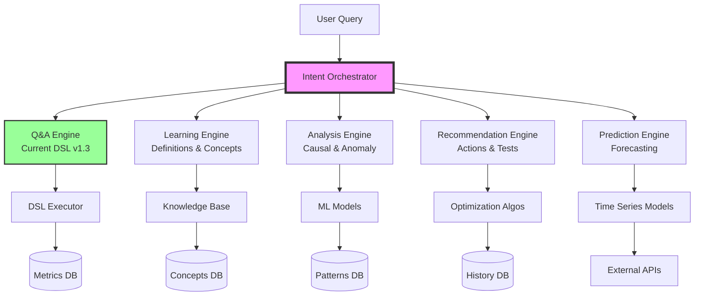

# AdNavi Agentic LLM Roadmap: From Q&A to Marketing Intelligence

**Version**: 1.0  
**Created**: 2025-10-05  
**Status**: Strategic Planning Document

---

## Executive Summary

AdNavi has built a solid foundation with DSL v1.3 - a production-ready Q&A system that translates natural language to database queries. However, to achieve the vision of a **fully agentic marketing intelligence assistant**, we need to evolve from answering "what" questions to providing "why" insights and "how" recommendations.

**Current Stage**: Advanced Q&A System (Stage 2 of 5)  
**Target Vision**: Autonomous Marketing Intelligence Agent (Stage 5)  
**Estimated Timeline**: 6-9 months  

---

## Table of Contents

1. [Vision & Goals](#vision--goals)
2. [Current State Analysis](#current-state-analysis)
3. [Gap Analysis](#gap-analysis)
4. [Development Stages](#development-stages)
5. [Technical Architecture](#technical-architecture)
6. [Implementation Roadmap](#implementation-roadmap)
7. [Success Metrics](#success-metrics)

---

## Vision & Goals

### Ultimate Vision
A fully autonomous marketing intelligence agent that:
- **Understands** marketing data at a deep level
- **Explains** complex concepts in simple terms
- **Analyzes** performance with causal reasoning
- **Benchmarks** against industry standards
- **Recommends** actionable improvements
- **Predicts** future outcomes
- **Acts** autonomously (with approval workflows)

### Key Capabilities Required

1. **Educational Intelligence**
   - "What is ROAS?" → Definition + formula + why it matters
   - "How is CPC calculated?" → Step-by-step explanation

2. **Causal Analysis**
   - "Why did ROAS drop last week?" → Identifies root causes
   - "What caused the spike in CPA?" → Anomaly detection + attribution

3. **Benchmarking Intelligence**
   - "Is my CPC good or bad?" → Industry comparisons
   - "How do I compare to similar businesses?" → Peer analysis

4. **Recommendation Engine**
   - "How can I improve CVR?" → Actionable suggestions
   - "What should I A/B test?" → Hypothesis generation

5. **Predictive Analytics**
   - "What will happen if I increase budget?" → Scenario modeling
   - "When will I hit my revenue target?" → Forecasting

---

## Current State Analysis

### What We Have (DSL v1.3)

#### ✅ Strong Foundation
- **Natural Language Understanding**: OpenAI GPT-4o-mini integration
- **Query System**: 3 types (metrics, providers, entities)
- **Metrics**: 24 total (12 base + 12 derived)
- **Context Management**: Multi-turn conversations
- **Data Access**: Hierarchy-aware breakdowns
- **Answer Generation**: Hybrid (facts + natural language)
- **Security**: Workspace isolation, no SQL injection
- **Testing**: 100+ unit tests

#### 📊 Current Query Examples Working Well
```
✅ "Which campaign had the highest ROAS?"
✅ "What was my CPC last week?"
✅ "Show me CTR by campaign"
✅ "And yesterday?" (context-aware follow-up)
✅ "List my active campaigns"
```

### Architecture Strengths
1. **Clean Separation**: DSL → Planning → Execution → Answer
2. **Extensible**: New metrics/features easy to add
3. **Observable**: Full telemetry and logging
4. **Safe**: No direct SQL, validated inputs
5. **Fast**: <1.5s end-to-end latency

---

## Gap Analysis

### Current Limitations vs Vision

| Capability | Current State | Target State | Gap |
|------------|--------------|--------------|-----|
| **Query Understanding** | Pattern matching with few-shot | Deep semantic understanding | Medium |
| **Data Access** | Current metrics only | Historical + external data | Large |
| **Analysis Depth** | Descriptive (what happened) | Causal (why it happened) | Large |
| **Recommendations** | None | Personalized, actionable | Critical |
| **Learning** | Static prompts | Learns from feedback | Critical |
| **Automation** | Query → Answer | Query → Insight → Action | Critical |

### Missing Components

1. **Knowledge Base**
   - Marketing definitions and concepts
   - Industry benchmarks
   - Best practices library
   - Historical patterns

2. **Analysis Engine**
   - Anomaly detection algorithms
   - Causal inference models
   - Statistical significance testing
   - Correlation analysis

3. **Recommendation System**
   - A/B test hypothesis generator
   - Budget optimization algorithms
   - Creative performance analyzer
   - Audience insights

4. **External Data Integration**
   - Industry benchmarks API
   - Competitor intelligence
   - Market trends
   - Seasonal patterns

---

## Development Stages

### Stage 1: Basic Q&A ✅ (Completed)
- Natural language → SQL queries
- Basic metrics retrieval
- Simple answers

### Stage 2: Advanced Q&A ✅ (Current - DSL v1.3)
- Complex queries with filters
- Multi-turn conversations
- Derived metrics
- Hierarchy-aware breakdowns

### Stage 3: Educational Assistant 🎯 (Next - 2 months)
- Marketing knowledge base
- Concept explanations
- Metric education
- Best practices

### Stage 4: Analytical Intelligence (3-4 months)
- Anomaly detection
- Causal analysis
- Benchmarking
- Trend analysis

### Stage 5: Autonomous Agent (6-9 months)
- Proactive recommendations
- Predictive modeling
- Automated optimizations
- Self-learning

---

## Technical Architecture

### Proposed Architecture for Full Vision



### New Components Needed

1. **Intent Orchestrator**
   - Routes queries to appropriate engine
   - Combines results from multiple engines
   - Manages complex multi-step analyses

2. **Knowledge Base System**
   ```python
   class KnowledgeBase:
       def get_definition(concept: str) -> Definition
       def get_formula(metric: str) -> Formula
       def get_benchmark(metric: str, industry: str) -> Benchmark
       def get_best_practices(scenario: str) -> List[Practice]
   ```

3. **Analysis Engine**
   ```python
   class AnalysisEngine:
       def detect_anomalies(metric: str, period: str) -> List[Anomaly]
       def find_correlations(metric1: str, metric2: str) -> Correlation
       def analyze_causation(effect: str, period: str) -> List[Cause]
       def compare_periods(metric: str, p1: str, p2: str) -> Comparison
   ```

4. **Recommendation Engine**
   ```python
   class RecommendationEngine:
       def suggest_improvements(metric: str, context: Dict) -> List[Action]
       def generate_hypotheses(goal: str) -> List[Hypothesis]
       def prioritize_actions(actions: List[Action]) -> List[Action]
       def estimate_impact(action: Action) -> Impact
   ```

---

## Implementation Roadmap

### Phase 1: Educational Intelligence (Months 1-2)

#### Sprint 1-2: Knowledge Base Foundation
- [ ] Design knowledge base schema
- [ ] Implement concept storage (definitions, formulas, examples)
- [ ] Create metric education content for all 24 metrics
- [ ] Build "What is X?" query handler

#### Sprint 3-4: Learning Enhancement
- [ ] Add visual formula representations
- [ ] Implement example calculations
- [ ] Create interactive tutorials
- [ ] Add "Why does X matter?" explanations

**Deliverable**: Users can ask "What is ROAS?" and get comprehensive education

### Phase 2: Causal Analysis (Months 3-4)

#### Sprint 5-6: Anomaly Detection
- [ ] Implement statistical anomaly detection
- [ ] Create alert thresholds system
- [ ] Build change detection algorithms
- [ ] Add "significant change" notifications

#### Sprint 7-8: Root Cause Analysis
- [ ] Implement dimension drill-down
- [ ] Create correlation analyzer
- [ ] Build contribution analysis
- [ ] Add "Why did X change?" handler

**Deliverable**: Users can ask "Why did ROAS drop?" and get root cause analysis

### Phase 3: Benchmarking & Comparison (Month 5)

#### Sprint 9-10: Benchmark Integration
- [ ] Integrate industry benchmark data
- [ ] Build peer comparison system
- [ ] Create performance scoring
- [ ] Add "Is my X good?" handler

**Deliverable**: Users can ask "Is my CPC good?" and get contextualized answer

### Phase 4: Recommendation Engine (Months 6-7)

#### Sprint 11-12: Basic Recommendations
- [ ] Build improvement suggestion system
- [ ] Create A/B test hypothesis generator
- [ ] Implement best practice matcher
- [ ] Add "How can I improve X?" handler

#### Sprint 13-14: Advanced Recommendations
- [ ] Build optimization algorithms
- [ ] Create personalized suggestions
- [ ] Implement impact estimation
- [ ] Add priority scoring

**Deliverable**: Users can ask "How can I improve CVR?" and get actionable plan

### Phase 5: Predictive & Autonomous (Months 8-9)

#### Sprint 15-16: Predictive Analytics
- [ ] Implement time series forecasting
- [ ] Build scenario modeling
- [ ] Create budget optimization
- [ ] Add "What if?" analysis

#### Sprint 17-18: Autonomous Features
- [ ] Build proactive alerting
- [ ] Create automated insights
- [ ] Implement approval workflows
- [ ] Add self-learning feedback loops

**Deliverable**: System proactively suggests optimizations and predicts outcomes

---

## Success Metrics

### Technical Metrics
- Query success rate: >95%
- Accuracy: >90% for causal analysis
- Test coverage: >80%

### Business Metrics
- User engagement: 5x increase in queries per user
- Time to insight: 80% reduction
- Actionable recommendations: >70% acceptance rate
- ROI improvement: 15-20% average across users

### User Experience Metrics
- NPS score: >70
- Feature adoption: >60% using advanced features
- Retention: >85% monthly active users
- Satisfaction: >4.5/5 rating

---

## Immediate Next Steps

### Week 1-2: Foundation
1. **Create knowledge base schema**
   ```sql
   CREATE TABLE knowledge_concepts (
       id UUID PRIMARY KEY,
       concept TEXT NOT NULL,
       category TEXT NOT NULL,
       definition TEXT NOT NULL,
       formula TEXT,
       examples JSONB,
       related_metrics TEXT[],
       importance_score INTEGER
   );
   ```

2. **Extend DSL for educational queries**
   ```python
   class QueryType(str, Enum):
       METRICS = "metrics"
       PROVIDERS = "providers"
       ENTITIES = "entities"
       EDUCATION = "education"  # NEW
       ANALYSIS = "analysis"    # NEW
   ```

3. **Create first educational content**
   - Start with top 10 metrics
   - Include formulas, examples, importance
   - Add visual representations

### Week 3-4: Prototype
1. **Build "What is X?" handler**
2. **Integrate with existing QA pipeline**
3. **Test with sample queries**
4. **Gather user feedback**

---

## Conclusion

AdNavi has built a solid foundation with DSL v1.3. The path to a fully agentic marketing intelligence assistant is clear and achievable. By following this roadmap, we can systematically add capabilities while maintaining the robustness and safety of the current system.

The key is to build incrementally, validate with users at each stage, and maintain our high standards for testing and security. Each phase builds on the previous, creating a compound effect that will ultimately deliver a truly revolutionary marketing intelligence platform.

**Ready to begin Phase 1?** The educational intelligence features can be implemented immediately without disrupting the current system, providing immediate value while laying groundwork for more advanced capabilities.

---

_"The best way to predict the future is to build it."_ - Let's build the future of marketing intelligence together.
