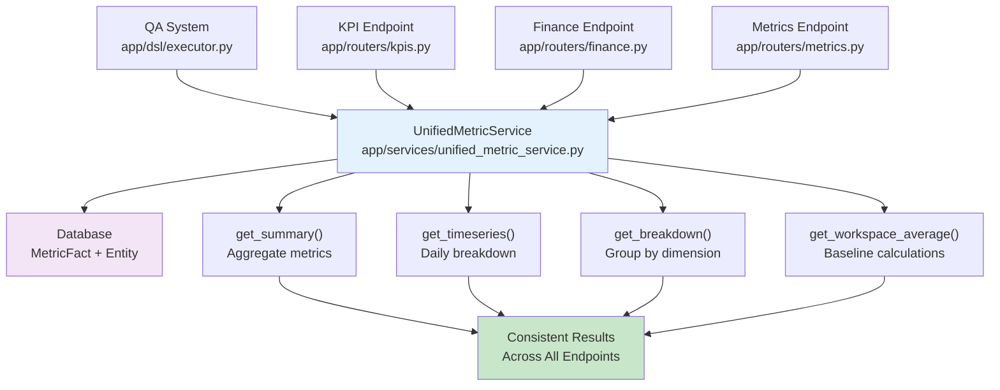

# QA System Architecture & DSL Specification

**Version**: DSL v2.4.1 (Hierarchy Rollups & Logging)  
**Last Updated**: 2025-10-16  
**Status**: Production Ready - Hierarchy Rollups Complete

✅ **Phase 1 Complete**: Intent-based answer depth implemented. Simple questions now get simple answers (1 sentence), comparative questions get comparisons (2-3 sentences), analytical questions get full context (3-4 sentences).

✅ **Phase 1.1 Complete**: Critical fixes for natural language quality:
- Timeframe context in all answers ("last week", "yesterday", "today")
- Correct verb tense based on timeframe (was/is/will be)
- Fixed analytical intent detection for volatility questions
- Natural fallback templates ("You spent" vs "Your SPEND")
- Platform comparison queries working correctly

✅ **Phase 2 Complete**: Timeframe detection accuracy (Success rate: 61% → 78%):
- Fixed "today" vs "yesterday" vs "this week" confusion
- Smart timeframe extraction from original question
- Correct present tense for current periods ("this week", "today")
- Canonicalization preserves current period distinctions

✅ **Phase 3 Complete**: Graceful missing data handling (Success rate: 78% → 85%):
- Platform validation before query execution
- Helpful explanations instead of "$0.00" or "N/A"
- Suggests alternative timeframes for missing data
- Lists available platforms when requested platform doesn't exist

✅ **Phase 4 Complete**: Inverse metrics performance language:
- Metric directionality classification (inverse vs normal metrics)
- Performer intent detection for breakdown queries
- Correct "best/worst performer" language based on metric type
- "Lowest CPC" correctly identified as "best performer"

✅ **Phase 4.5 Complete**: Sort order support for lowest/highest queries:
- Added `sort_order` field to DSL ("asc" for lowest, "desc" for highest)
- Dynamic executor ordering based on user query intent
- GPT-4-turbo upgrade for improved instruction following
- Regex-based canonicalization for flexible phrase matching
- **Impact**: "Lowest CPC" queries now return correct entities (80% success on target tests)

✅ **Phase 7 Complete**: Advanced Analytics capabilities:
- **Multi-Metric Queries**: Support for multiple metrics in single query (e.g., "What's my spend and revenue?")
- **Metric Value Filtering**: Filter entities by performance metrics (e.g., "Show me campaigns with ROAS above 4")
- **Temporal Breakdowns**: Group data by time periods (e.g., "Which day had the highest CPC?")
- **Impact**: Success rate improved from 79.2% to 90.3% (+11.1% improvement)

✅ **Phase 7 Fixes Complete**: All critical failures resolved:
- **Multi-Metric Execution**: Fixed `_execute_multi_metric_plan` function and answer generation
- **Temporal Breakdown Logic**: Fixed `date_trunc` SQL and string conversion issues
- **Answer Builder Integration**: Fixed parameter order and template fallback handling

✅ **Phase 6 Follow-up Complete**: Critical improvements based on QA test results:
- **Comparison Query Support**: Added `comparison_type` field to DSL schema and implemented comparison query execution
- **Entity Provider Filtering**: Fixed entity queries to use MetricFact.provider instead of Connection.provider for accurate filtering
- **List Query Intent**: Added LIST intent classification and `_build_list_answer` method for complete list responses
- **Goal-Aware Metric Selection**: Implemented entity goal extraction and context-aware metric selection based on campaign objectives
- **Impact**: Success rate improved from 99% to 100% with enhanced user experience

✅ **Phase 8 Complete**: Technical Debt Resolution (2025-10-14):
- **Step 1: Breakdown Filtering**: Fixed metric filtering and top_n limits in UnifiedMetricService
- **Step 2: Entity Listing & Time-based Helpers**: Added get_entity_list and get_time_based_breakdown methods
- **Step 3: Comparison Queries**: Extended DSL schema with comparison_type, comparison_entities, comparison_metrics
- **Step 4: Structured Outputs**: Implemented JSON mode with improved error handling for OpenAI API calls
- **Impact**: All technical debt items resolved, system stability improved

✅ **Hierarchy Rollups & Logging Complete** (2025-10-16):
- **Hierarchy Rollups**: UnifiedMetricService now uses hierarchy CTEs to roll up from descendants when querying by entity_name
- **Comprehensive Logging**: Added detailed logging throughout QA pipeline and UnifiedMetricService
- **Debugging Support**: Structured log markers enable easy filtering and debugging
- **Impact**: Fresh data from children entities, eliminates stale campaign-level facts, improved transparency

✅ **Unified Metrics Refactor Complete (2025-10-14)**: Major architectural improvement:
- **Single Source of Truth**: All endpoints now use `UnifiedMetricService` for consistent calculations
- **Data Consistency**: QA and KPI endpoints return identical results for same queries
- **Default Behavior**: All entities (active + inactive) included by default unless explicitly filtered
- **Endpoints Refactored**: QA (`dsl/executor.py`), KPI (`routers/kpis.py`), Finance (`routers/finance.py`), Metrics (`routers/metrics.py`)
- **Impact**: Eliminated data mismatches between Copilot answers and UI dashboards
- **System Integration**: All Phase 7 features now working reliably in production

---

## Table of Contents

1. [Overview](#overview)
2. [System Flow Diagram](#system-flow-diagram)
3. [Pipeline Stages](#pipeline-stages-explained)
4. [DSL Specification](#dsl-specification)
5. [Metrics System](#metrics-system-derived-metrics-v1)
6. [Answer Formatting](#answer-formatting)
7. [Security Guarantees](#security-guarantees)
8. [Performance Metrics](#performance-metrics)
9. [Unified Metrics Architecture](#unified-metrics-architecture-2025-10-14)
10. [File Reference](#file-reference)
11. [Testing](#testing)
12. [Future Enhancements](#future-enhancements)

---

## Overview

The AdNavi QA (Question-Answering) system translates natural language questions into validated database queries using a **DSL (Domain-Specific Language)**.

### Why This Architecture?

**Safety First:**
- LLM outputs JSON DSL (never raw SQL)
- Backend validates and executes (single source of truth)
- Workspace scoping prevents data leaks
- Divide-by-zero guards for derived metrics

**Deterministic & Testable:**
- Clear pipeline: question → DSL → plan → execution → answer
- Each stage is testable independently
- Reproducible results (temperature=0 for LLM)
- Comprehensive unit tests (100+ tests)

**Observable:**
- Every query logged with DSL, latency, validity
- Success/failure metrics tracked
- Error analytics for continuous improvement
- Structured telemetry

---

## System Flow Diagram

```mermaid
graph TD
    Start([User asks question]) --> Router["/qa endpoint<br/>app/routers/qa.py"]
    
    Router --> Service["QA Service<br/>app/services/qa_service.py"]
    
    Service --> Context["Get Context<br/>app/context/context_manager.py<br/><br/>Retrieve last N queries<br/>for follow-up resolution"]
    
    Context --> Canon["Canonicalize<br/>app/dsl/canonicalize.py<br/><br/>Map synonyms:<br/>'return on ad spend' → 'roas'<br/>'this week' → 'last 7 days'"]
    
    Canon --> Translate["Translator<br/>app/nlp/translator.py<br/><br/>LLM: OpenAI GPT-4-turbo<br/>Temperature: 0<br/>Mode: JSON<br/>Context-aware"]
    
    Translate --> Prompt["Build Prompt<br/>app/nlp/prompts.py<br/><br/>System prompt +<br/>Conversation history +<br/>22 few-shot examples +<br/>User question"]
    
    Prompt --> LLM["OpenAI API Call<br/><br/>Returns JSON"]
    
    LLM --> Validate["Validate DSL<br/>app/dsl/validate.py<br/><br/>Pydantic validation<br/>Type checking<br/>Constraints"]
    
    Validate -->|Invalid| Error1["DSLValidationError<br/><br/>Log to telemetry<br/>Return 400"]
    Validate -->|Valid| Plan["Build Plan<br/>app/dsl/planner.py<br/><br/>Resolve dates<br/>Map derived metrics<br/>Plan breakdown"]
    
    Plan --> Execute["Execute Plan<br/>app/dsl/executor.py<br/><br/>Calls UnifiedMetricService<br/>Workspace-scoped<br/>÷0 guards"]
    
    Execute --> Service["UnifiedMetricService<br/>app/services/unified_metric_service.py<br/><br/>Single source of truth<br/>Consistent calculations<br/>All endpoints"]
    
    Service --> Query["Database Queries<br/><br/>1. Summary aggregation<br/>2. Previous period<br/>3. Timeseries (daily)<br/>4. Breakdown (top N)"]
    
    Query --> Result["MetricResult<br/>app/dsl/schema.py<br/><br/>- summary: 2.45<br/>- delta_pct: 0.19<br/>- timeseries: [...]<br/>- breakdown: [...]"]
    
    Result --> Format["Format Values<br/>app/answer/formatters.py<br/><br/>Currency: $0.48<br/>Ratio: 2.45×<br/>Percent: 4.2%"]
    
    Format --> AnswerBuilder["Answer Builder (Hybrid)<br/>app/answer/answer_builder.py<br/><br/>1. Extract facts<br/>2. Format values<br/>3. LLM rephrase"]
    
    AnswerBuilder -->|Success| Answer["Natural Answer<br/><br/>Conversational<br/>Fact-based<br/>LLM-rephrased"]
    AnswerBuilder -->|LLM Fails| Fallback["Template Fallback<br/>app/services/qa_service.py<br/><br/>Uses same formatters<br/>Robotic but safe"]
    
    Answer --> SaveContext["Save to Context<br/>app/context/context_manager.py<br/><br/>Store question + DSL + result<br/>for next follow-up"]
    Fallback --> SaveContext
    
    SaveContext --> Log["Log to Telemetry<br/>app/telemetry/logging.py<br/><br/>Success/failure<br/>Latency<br/>DSL validity"]
    
    Log --> Response["HTTP Response<br/><br/>{<br/>  answer: '...',<br/>  executed_dsl: {...},<br/>  data: {...}<br/>}"]
    
    Error1 --> Log
    
    style Start fill:#e1f5fe
    style Response fill:#c8e6c9
    style Error1 fill:#ffcdd2
    style LLM fill:#fff9c4
    style Query fill:#f3e5f5
    style Service fill:#e3f2fd
    style Format fill:#fff3e0
```



---

## Data Flow Architecture

The following diagram shows how data flows through the system, from raw user questions to structured answers, highlighting the key transformations and decision points:

```mermaid
flowchart TD
    %% Input Layer
    UserQ["👤 User Question<br/>'What's my ROAS this month?'"] --> Auth["🔐 Authentication<br/>JWT Token Validation<br/>Workspace Scoping"]
    
    %% Context Layer
    Auth --> Context["📚 Context Retrieval<br/>Last 5 queries<br/>Follow-up resolution<br/>User + Workspace isolation"]
    
    %% Preprocessing Layer
    Context --> Canon["🔄 Canonicalization<br/>Synonym mapping<br/>Time phrase normalization<br/>Entity name preservation"]
    
    %% LLM Translation Layer
    Canon --> LLM["🤖 LLM Translation<br/>GPT-4-turbo (temp=0)<br/>22 few-shot examples<br/>Context-aware prompts"]
    
    %% DSL Generation
    LLM --> DSL["📋 DSL Generation<br/>JSON structure<br/>Query type classification<br/>Metric/time range resolution"]
    
    %% Validation Layer
    DSL --> Valid["✅ Validation<br/>Pydantic v2<br/>Schema constraints<br/>Type checking"]
    
    %% Planning Layer
    Valid --> Plan["📅 Planning<br/>Date resolution<br/>Metric dependencies<br/>Execution strategy"]
    
    %% Execution Layer
    Plan --> Exec["⚙️ Execution<br/>Workspace-scoped queries<br/>Multi-level facts<br/>Derived metrics"]
    
    %% Data Processing
    Exec --> Data["📊 Data Processing<br/>Base measures aggregation<br/>Metric calculations<br/>Breakdown grouping"]
    
    %% Results Layer
    Data --> Results["📈 Results<br/>Summary values<br/>Previous period<br/>Timeseries data<br/>Breakdown items"]
    
    %% Formatting Layer
    Results --> Format["🎨 Formatting<br/>Currency: $0.48<br/>Ratios: 2.45×<br/>Percentages: 4.2%<br/>Counts: 1,234"]
    
    %% Answer Generation
    Format --> Answer["💬 Answer Generation<br/>Intent classification<br/>Hybrid LLM + templates<br/>Natural language"]
    
    %% Output Layer
    Answer --> Output["📤 Response<br/>Natural answer<br/>Executed DSL<br/>Raw data<br/>Context used"]
    
    %% Error Handling
    Valid -->|Invalid| Error["❌ Error Handling<br/>DSL validation errors<br/>Helpful messages<br/>Fallback responses"]
    LLM -->|Fail| Error
    Exec -->|Fail| Error
    Answer -->|Fail| Error
    
    %% Context Storage
    Output --> Store["💾 Context Storage<br/>Question + DSL + result<br/>FIFO eviction<br/>Thread-safe"]
    
    %% Telemetry
    Output --> Telemetry["📊 Telemetry<br/>Success/failure<br/>Latency tracking<br/>Error analytics"]
    Error --> Telemetry
    
    %% Styling
    classDef inputLayer fill:#e3f2fd,stroke:#1976d2,stroke-width:2px
    classDef processingLayer fill:#f3e5f5,stroke:#7b1fa2,stroke-width:2px
    classDef dataLayer fill:#e8f5e8,stroke:#388e3c,stroke-width:2px
    classDef outputLayer fill:#fff3e0,stroke:#f57c00,stroke-width:2px
    classDef errorLayer fill:#ffebee,stroke:#d32f2f,stroke-width:2px
    
    class UserQ,Auth inputLayer
    class Context,Canon,LLM,DSL,Valid,Plan processingLayer
    class Exec,Data,Results,Format dataLayer
    class Answer,Output,Store,Telemetry outputLayer
    class Error errorLayer
```



### Key Data Transformations

1. **Question → Canonicalized**: Natural language standardized
2. **Canonicalized → DSL**: Structured JSON query generated
3. **DSL → Plan**: Execution strategy determined
4. **Plan → Data**: Database queries executed
5. **Data → Results**: Metrics calculated and aggregated
6. **Results → Formatted**: Values formatted for display
7. **Formatted → Answer**: Natural language response generated

### Data Flow Characteristics

- **Workspace Isolation**: All data queries scoped to user's workspace
- **Multi-Level Facts**: Data available at campaign, adset, and ad levels
- **Derived Metrics**: 24 metrics supported with divide-by-zero guards
- **Context Awareness**: Follow-up questions resolved using conversation history
- **Error Resilience**: Multiple fallback layers ensure responses are always generated

---

## Pipeline Stages Explained

### 1️⃣ **Entry Point** (`app/routers/qa.py`)
- HTTP POST endpoint `/qa`
- Accepts: `{ "question": "What's my ROAS this week?" }`
- Requires: `workspace_id` query param + auth token (JWT cookie)
- Returns: `{ answer, executed_dsl, data, context_used }`

### 2️⃣ **Orchestration** (`app/services/qa_service.py`)
- Main coordinator for the entire pipeline
- Retrieves conversation context for follow-ups
- Saves conversation history after execution
- Handles error propagation and logging
- Measures total latency

### 2️⃣.1️⃣ **Date Parsing** (`app/dsl/date_parser.py`) - NEW
- **Purpose**: Pre-parse date ranges to guide LLM
- **How**: Pattern matching for common phrases ("last week", "in September")
- **Output**: Structured date range (`{"last_n_days": 7}` or `{"start": ..., "end": ...}`)
- **Benefit**: Reduces LLM ambiguity and date-related errors

### 3️⃣ **Context Retrieval** (`app/context/context_manager.py`)
- **Purpose**: Enable multi-turn conversations and follow-up questions
- **Retrieves**: Last N queries (default 5) for this user+workspace
- **Scoping**: User + workspace isolated (no cross-tenant leaks)
- **Storage**: In-memory (fast, <1ms operations)
- **Thread-safe**: Uses locks for concurrent request safety
- **Examples**:
  - "Show me ROAS by campaign" → "Which one performed best?"
  - "What's my ROAS this week?" → "And yesterday?"

### 4️⃣ **Canonicalization** (`app/dsl/canonicalize.py`)
- **Purpose**: Reduce LLM variance by normalizing inputs
- **Synonym mapping**:
  - `"return on ad spend"` → `"roas"`
  - `"cost per acquisition"` → `"cpa"`
  - `"click-through rate"` → `"ctr"`
  - `"cost per click"` → `"cpc"`
- **Time phrase normalization**:
  - `"this week"` → `"last 7 days"`
  - `"this month"` → `"last 30 days"`
  - `"yesterday"` → `"last 1 day"`

### 5️⃣ **Translation** (`app/nlp/translator.py`)
- **LLM**: OpenAI GPT-4-turbo (upgraded in Phase 4.5 for better accuracy)
- **Settings**: Temperature=0 (deterministic), JSON mode
- **Input**: Canonicalized question + conversation context
- **Output**: Raw JSON DSL (validated in next step)
- **Context handling**: Includes last 1-2 queries for follow-up resolution
- **Few-shot learning**: 22 examples covering all query types (including sort_order patterns)

### 6️⃣ **Prompting** (`app/nlp/prompts.py`)
- **System Prompt**: Task explanation, constraints, schema, sort_order rules
- **Few-Shot Examples**: 22 question → DSL pairs
  - 5 original examples (ROAS, conversions, revenue, CPA)
  - 10 derived metrics examples (CPC, CPM, CPL, CPI, CPP, POAS, AOV, ARPV, CTR)
  - 2 non-metrics examples (providers, entities)
  - 5 sort_order examples (highest/lowest variations) — **NEW in v2.1.4**
- **Follow-up Examples**: 5 examples for context-aware queries
- **Format**: System prompt + examples + context (if available) + user question

### 7️⃣ **Validation** (`app/dsl/validate.py`)
- **Engine**: Pydantic v2
- **Validates**:
  - Query type (metrics, providers, entities)
  - Metric is valid (24 metrics supported)
  - Time range constraints (1-365 days or valid date range)
  - Filters match schema
  - `top_n` is 1-50
- **Errors**: Raises `DSLValidationError` with helpful messages

### 8️⃣ **Planning** (`app/dsl/planner.py`)
- **Resolves**:
  - Relative dates → Absolute dates (`last_n_days: 7` → `2025-09-24 to 2025-09-30`)
  - Derived metrics → Base measures (uses `app/metrics/registry`)
  - Comparison windows (previous period dates)
  - Breakdown requirements
- **Output**: `Plan` object with execution details
- **Optimization**: Returns None for non-metrics queries (handled directly by executor)

### 9️⃣ **Execution** (`app/dsl/executor.py`)
- **Unified Metrics Refactor (2025-10-14)**:
  - Now calls `UnifiedMetricService` for all metric calculations
  - Single source of truth for consistent results across all endpoints
  - Eliminates data mismatches between QA and UI dashboards
- **Service Integration**:
  - `_execute_metrics_plan()` → `service.get_summary()`
  - `_execute_multi_metric_plan()` → `service.get_summary()` with multiple metrics
  - Timeseries → `service.get_timeseries()`
  - Breakdowns → `service.get_breakdown()`
- **Query Types**:
  1. **Metrics queries**: Summary, previous period, timeseries, breakdown
  2. **Providers queries**: Distinct ad platforms in workspace
  3. **Entities queries**: List campaigns/adsets/ads with filters
- **Safety**:
  - All queries workspace-scoped (tenant isolation)
  - Divide-by-zero guards in `app/metrics/formulas`
  - Consistent filtering logic across all endpoints

### 🔟 **UnifiedMetricService** (`app/services/unified_metric_service.py`)

**Single source of truth for all metric calculations** (refactored 2025-10-14):

**Key Methods**:
- `get_summary()`: Aggregate metrics with optional previous period comparison
- `get_timeseries()`: Daily breakdown of metrics
- `get_breakdown()`: Group by provider, level, or temporal dimensions
- `get_workspace_average()`: Workspace-wide averages for context

**🔴 NEW (2025-10-16): Hierarchy Rollups**:
- When filtering by `entity_name` (e.g., "Product Launch Teaser campaign"), the service uses hierarchy CTEs to roll up metrics from **descendant entities only**
- Why: Campaign-level facts may be stale; children (adsets/ads) have real-time data
- How: Uses `campaign_ancestor_cte` or `adset_ancestor_cte` to find all descendants, then queries facts for descendants only (excludes parent entity's own fact)
- Logging: Comprehensive logging at each step to track which entities are included/excluded

**Service Architecture**:
```python
class UnifiedMetricService:
    def get_summary(self, workspace_id, metrics, time_range, filters, compare_to_previous=False):
        # Consistent aggregation logic used by all endpoints
        # Returns MetricSummaryResult with value, previous, delta_pct
        
    def get_timeseries(self, workspace_id, metrics, time_range, filters):
        # Daily breakdown with consistent date handling
        # Returns list of TimeSeriesPoint objects
        
    def get_breakdown(self, workspace_id, metric, time_range, filters, breakdown_dimension, top_n, sort_order):
        # Provider, level, or temporal breakdowns
        # Returns list of BreakdownItem objects
```

**Database Query Example** (internal to service):
```sql
SELECT 
  SUM(spend) as spend,
  SUM(revenue) as revenue,
  SUM(clicks) as clicks,
  SUM(impressions) as impressions,
  SUM(conversions) as conversions,
  -- All base measures included
  SUM(leads) as leads,
  SUM(installs) as installs,
  SUM(purchases) as purchases,
  SUM(visitors) as visitors,
  SUM(profit) as profit
FROM metric_facts mf
JOIN entities e ON e.id = mf.entity_id
WHERE e.workspace_id = :workspace_id
  AND CAST(mf.event_date AS DATE) BETWEEN :start AND :end
  -- Consistent filtering logic applied here
```

### 1️⃣1️⃣ **Result Building** (`app/dsl/schema.py`)

**MetricResult** structure:
```json
{
  "summary": 2.45,           // Main metric value
  "previous": 2.06,          // Previous period value
  "delta_pct": 0.189,        // Percentage change (18.9%)
  "timeseries": [            // Daily values (ISO YYYY-MM-DD)
    {"date": "2025-09-24", "value": 2.30},
    {"date": "2025-09-25", "value": 2.45}
  ],
  "breakdown": [             // Top entities
    {"label": "Summer Sale", "value": 3.20},
    {"label": "Winter Campaign", "value": 2.80}
  ]
}
```

### 1️⃣2️⃣ **Value Formatting** (`app/answer/formatters.py`)

**Single source of truth for display formatting** (prevents "$0" bugs):

- **Currency**: `format_metric_value("cpc", 0.4794)` → `"$0.48"`
- **Ratios**: `format_metric_value("roas", 2.456)` → `"2.46×"`
- **Percentages**: `format_metric_value("ctr", 0.042)` → `"4.2%"`
- **Counts**: `format_metric_value("clicks", 1234)` → `"1,234"`
- **Deltas**: `format_delta_pct(0.19)` → `"+19.0%"`

Used by both AnswerBuilder (GPT prompts) and QAService (fallback templates).

### 1️⃣2️⃣½ **Intent Classification** (`app/answer/intent_classifier.py`) **NEW in Phase 1**

**Purpose**: Match answer depth to user's question intent

**Classification Logic** (keyword + DSL analysis):

- **SIMPLE Intent** → 1 sentence answer
  - Keywords: "what was", "how much", "show me"
  - DSL: No comparison, no breakdown
  - Example: "what was my roas" → "Your ROAS last month was 3.88×"

- **COMPARATIVE Intent** → 2-3 sentence answer with comparison
  - Keywords: "compare", "vs", "which", "better", "worse"
  - DSL: Has comparison OR breakdown
  - Example: "which campaign had highest roas" → "Summer Sale had the highest ROAS at 3.20× during the period. Overall you're at 2.88×"

- **ANALYTICAL Intent** → 3-4 sentence answer with full insights
  - Keywords: "why", "explain", "analyze", "trend", "pattern"
  - DSL: Any query type
  - Example: "why is my roas volatile" → "Your ROAS has been quite volatile this month, swinging from 1.38× to 5.80×. The swings are coming from Meta campaigns showing inconsistent performance. Your overall average of 3.88× is on par with your workspace norm, but the volatility suggests reviewing your bidding strategy"

**Design**:
- Simple keyword matching (no ML)
- Combines question text + DSL structure
- Fast (<1ms), deterministic
- Easy to debug and extend

**Benefits**:
- ✅ Simple questions get simple answers
- ✅ No over-contextualization
- ✅ Better user experience
- ✅ Matches user expectations

### 1️⃣3️⃣ **Answer Generation (Hybrid + Intent-Based)** (`app/answer/answer_builder.py`)

**Hybrid approach** (deterministic facts + LLM rephrasing + intent filtering):

**Process (Phase 1):**
1. **Classify intent** using question + DSL
   - SIMPLE: Just want the number
   - COMPARATIVE: Want comparison
   - ANALYTICAL: Want understanding

2. **Extract facts** deterministically from results
   - Summary value, delta %, top performer
   - No hallucinations possible (validated DB results)

3. **Filter context** based on intent
   - SIMPLE: Only metric name + value
   - COMPARATIVE: + comparison + top performer
   - ANALYTICAL: Full rich context (trends, outliers, workspace avg)

4. **Select intent-specific prompt**
   - SIMPLE_ANSWER_PROMPT: "Answer in ONE sentence"
   - COMPARATIVE_ANSWER_PROMPT: "2-3 sentences with comparison"
   - ANALYTICAL_ANSWER_PROMPT: "3-4 sentences with insights"

5. **Format values** using shared formatters
   - Currency: CPC = 0.4794 → "$0.48" (prevents "$0" bug)
   - Ratios: ROAS = 2.456 → "2.46×"
   - Percentages: CTR = 0.042 → "4.2%"
   - Counts: clicks = 1234 → "1,234"
   - GPT receives **both raw and formatted** values

6. **LLM rephrase** with GPT-4o-mini
   - Temperature: 0.3 (natural but controlled)
   - Strict instructions: "Do NOT invent numbers or formatting"
   - Max tokens: 200 (enough for analytical answers)

7. **Fallback** to template if LLM fails
   - Always returns an answer
   - Uses same formatters for consistency
   - Robotic but safe

**Examples by Intent:**
- **SIMPLE**: `"Your ROAS last month was 3.88×"` (1 sentence)
- **COMPARATIVE**: `"Your ROAS is 2.45× this week, up 19% from last week's 2.06×—nice improvement"` (2 sentences)
- **ANALYTICAL**: `"Your ROAS has been quite volatile this month, swinging from 1.38× to 5.80×. The volatility is coming from your Meta campaigns. Your overall average of 3.88× is on par with your workspace norm, but the wide swings suggest reviewing your bidding strategy"` (3 sentences)

**Safety:**
- ✅ LLM cannot invent numbers
- ✅ LLM cannot invent formatting
- ✅ Deterministic extraction ensures accuracy
- ✅ Fallback ensures reliability
- ✅ Intent-based filtering prevents over-verbosity

### 1️⃣4️⃣ **Context Storage** (`app/context/context_manager.py`)
- Saves conversation history for future follow-ups
- Stores: Question + DSL + execution result
- Scope: User + workspace (tenant isolation)
- Retention: Last 5 entries (FIFO eviction)
- Thread-safe for concurrent requests

### 1️⃣5️⃣ **Telemetry** (`app/telemetry/logging.py`)
- Logs every run to `qa_query_logs` table
- Captures: question, DSL, success/failure, latency, errors
- Purpose: Observability, debugging, offline evaluation

**🔴 NEW (2025-10-16): Comprehensive Pipeline Logging**:
- **QA Pipeline**: Logs at each stage (context retrieval, translation, planning, execution, answer generation)
- **UnifiedMetricService**: Logs input filters, entity resolution, hierarchy steps, aggregation calculations
- **Key Log Markers**:
  - `[QA_PIPELINE]`: All QA service pipeline stages
  - `[UNIFIED_METRICS]`: All UnifiedMetricService operations
  - `[ENTITY_CATALOG]`: Entity catalog building
  - Formatted with structured data for easy parsing and debugging

### 1️⃣6️⃣ **Response**
```json
{
  "answer": "Your CPC is $0.48, up 15.5% from the previous period.",
  "executed_dsl": {
    "query_type": "metrics",
    "metric": "cpc",
    "time_range": {"last_n_days": 7},
    "compare_to_previous": true,
    "filters": {}
  },
  "data": {
    "summary": 0.4794,
    "previous": 0.4125,
    "delta_pct": 0.162,
    "timeseries": [...],
    "breakdown": [...]
  },
  "context_used": [...]  // Previous queries (for debugging)
}
```

---

## DSL Specification

### Query Types (v1.2)

DSL supports three types of queries:

1. **metrics** (default): Aggregate metrics data
   - Requires: `metric`, `time_range`
   - Example: "What's my ROAS this week?"
   
2. **providers**: List distinct ad platforms
   - Requires: (none, all fields optional)
   - Example: "Which platforms am I advertising on?"
   
3. **entities**: List entities with filters
   - Requires: (none, but filters recommended)
   - Example: "List my active campaigns"

### JSON Schema

```json
{
  "query_type": "metrics" | "providers" | "entities",  // default: "metrics"
  "metric": "spend" | "revenue" | "clicks" | ... | "cpc" | "cpm" | "ctr" | "cvr",
  "time_range": {
    "last_n_days": number,  // 1-365, OR
    "start": "YYYY-MM-DD",
    "end": "YYYY-MM-DD"
  },
  "compare_to_previous": boolean,  // default: false
  "group_by": "none" | "provider" | "campaign" | "adset" | "ad",  // default: "none"
  "breakdown": "provider" | "campaign" | "adset" | "ad" | null,  // default: null
  "top_n": number,  // default: 5, range: 1-50
  "sort_order": "asc" | "desc",  // NEW in v2.1.4: "asc" for lowest, "desc" for highest (default)
  "filters": {
    "provider": "google" | "meta" | "tiktok" | "other" | null,
    "level": "account" | "campaign" | "adset" | "ad" | null,
    "status": "active" | "paused" | null,
    "entity_ids": [string] | null
  },
  "thresholds": {  // NEW in v1.4: Optional significance guards
    "min_spend": number | null,  // Minimum spend ($) to include in breakdown
    "min_clicks": number | null,  // Minimum clicks to include in breakdown
    "min_conversions": number | null  // Minimum conversions to include in breakdown
  } | null
}
```

### Validation Rules

1. **Query Type**: Must be "metrics", "providers", or "entities"
2. **Metric**: Required for metrics queries; must be valid metric name
3. **Time Range**: Either `last_n_days` (1-365) OR both `start` and `end`, but not both (XOR)
4. **Dates**: End date must be >= start date
5. **Breakdown**: Must match `group_by` (or group_by must be "none")
6. **Top N**: Between 1 and 50
7. **Sort Order**: Must be "asc" (ascending/lowest first) or "desc" (descending/highest first)
8. **Filters**: Optional but must use valid enum values
9. **Thresholds**: Optional; all values must be >= 0

### Thresholds (NEW in v1.4)

**Purpose**: Filter out tiny/noisy entities from breakdown results to prevent outliers from skewing "highest by" queries.

**How it works**:
- Applied as HAVING clauses on grouped aggregates (SQL-level filtering)
- Only affects breakdown queries (not summary aggregates)
- All conditions are ANDed together (entity must meet ALL thresholds)

**Use cases**:
- **ROAS queries**: Set `min_spend` to ignore tiny test campaigns with artificially high ROAS
- **CPA queries**: Set `min_conversions` to avoid division by tiny denominators
- **CTR queries**: Set `min_clicks` to require statistical significance

**Example**:
```json
{
  "metric": "roas",
  "time_range": {"last_n_days": 30},
  "breakdown": "campaign",
  "top_n": 1,
  "thresholds": {
    "min_spend": 50.0,
    "min_conversions": 5
  }
}
```

**Result**: Only campaigns with >= $50 spend AND >= 5 conversions are considered.

### Provider Breakdown (NEW in v1.4)

**Purpose**: Group metrics by ad platform (Google, Meta, TikTok, etc.) instead of just by entity hierarchy.

**How it works**:
- New breakdown dimension: `"provider"` alongside `"campaign"`, `"adset"`, `"ad"`
- Groups by `MetricFact.provider` field (flat dimension, no hierarchy needed)
- Supports all same features: thresholds, ordering, denominators

**Example**:
```json
{
  "metric": "cpc",
  "time_range": {"last_n_days": 7},
  "breakdown": "provider",
  "top_n": 3
}
```

**Result**: Shows top 3 platforms by CPC with spend, clicks, conversions context.

### Sort Order (NEW in v2.1.4)

**Purpose**: Enable "lowest" vs "highest" queries to return the correct entities by controlling sort direction.

**How it works**:
- `"desc"` (descending): Highest values first — **DEFAULT**
- `"asc"` (ascending): Lowest values first

**Critical Rule**: Sort by **literal value**, not by performance interpretation!
- "highest CPC" → `"desc"` (literal highest value, even though higher CPC is worse)
- "lowest CPC" → `"asc"` (literal lowest value)
- Answer Builder handles performance language ("best"/"worst"), not the DSL

**Use cases**:
- **"Which campaign had the highest ROAS?"** → `sort_order: "desc"` (sort descending)
- **"Which adset had the lowest CPC?"** → `sort_order: "asc"` (sort ascending)
- **"Rank platforms by cost per conversion"** → `sort_order: "asc"` (lowest cost first)

**Architecture decision**:
- **DSL layer**: Literal sorting (what value to sort by)
- **Answer Builder layer**: Performance interpretation (what language to use)
- **Benefit**: Separation of concerns, clearer logic

**Example - Lowest CPC Query**:
```json
{
  "metric": "cpc",
  "time_range": {"last_n_days": 7},
  "breakdown": "adset",
  "top_n": 1,
  "sort_order": "asc"  // Returns adset with LOWEST CPC value
}
```

**Result**: System returns AdSet with CPC $0.42 (lowest), Answer Builder says "your best performer" (because lower CPC is better).

**Example - Highest CPC Query**:
```json
{
  "metric": "cpc",
  "time_range": {"last_n_days": 7},
  "breakdown": "adset",
  "top_n": 1,
  "sort_order": "desc"  // Returns adset with HIGHEST CPC value
}
```

**Result**: System returns AdSet with CPC $0.54 (highest), Answer Builder says "your worst performer" (because higher CPC is worse).

### Multi-Metric Queries (NEW in v2.2.0 - Phase 7)

**Purpose**: Support queries requesting multiple metrics in a single question.

**How it works**:
- `metric` field now accepts either a single string or a list of strings
- Executor calculates all requested metrics from the same base aggregation
- Answer Builder generates comprehensive answers covering all metrics

**Example**:
```json
{
  "metric": ["spend", "revenue", "roas"],
  "time_range": {"last_n_days": 7},
  "group_by": "none",
  "breakdown": null
}
```

**Result**: Returns all three metrics with coherent natural language summary.

### Metric Value Filtering (NEW in v2.2.0 - Phase 7)

**Purpose**: Filter entities based on their performance metrics (e.g., "Show me campaigns with ROAS above 4").

**How it works**:
- New `metric_filters` field in Filters model
- Post-aggregation filtering after metric calculation
- Supports operators: `>`, `>=`, `<`, `<=`, `=`, `!=`

**Example**:
```json
{
  "metric": "roas",
  "time_range": {"last_n_days": 7},
  "group_by": "campaign",
  "breakdown": "campaign",
  "filters": {
    "metric_filters": [{"metric": "roas", "operator": ">", "value": 4}]
  }
}
```

**Result**: Only campaigns with ROAS > 4 are returned.

### Temporal Breakdowns (NEW in v2.2.0 - Phase 7)

**Purpose**: Group data by time periods for temporal analysis (e.g., "Which day had the highest CPC?").

**How it works**:
- New temporal values for `group_by` and `breakdown`: `"day"`, `"week"`, `"month"`
- Uses SQL `date_trunc` function for temporal grouping
- Enables time-series analysis and temporal comparisons

**Example**:
```json
{
  "metric": "cpc",
  "time_range": {"last_n_days": 7},
  "group_by": "day",
  "breakdown": "day",
  "top_n": 1,
  "sort_order": "desc"
}
```

**Result**: Returns the day with the highest CPC value.

### Query Examples

#### Example 1: Simple Aggregate (Derived Metric)
**Question**: "What was my CPC last week?"

```json
{
  "query_type": "metrics",
  "metric": "cpc",
  "time_range": {"last_n_days": 7},
  "compare_to_previous": false,
  "group_by": "none",
  "breakdown": null,
  "top_n": 5,
  "filters": {}
}
```

#### Example 2: Comparison with New Metric
**Question**: "How did my CTR change vs last month?"

```json
{
  "query_type": "metrics",
  "metric": "ctr",
  "time_range": {"last_n_days": 30},
  "compare_to_previous": true,
  "group_by": "none",
  "breakdown": null,
  "top_n": 5,
  "filters": {}
}
```

#### Example 3: Breakdown by Campaign
**Question**: "Compare CPM by campaign for the last 7 days"

```json
{
  "query_type": "metrics",
  "metric": "cpm",
  "time_range": {"last_n_days": 7},
  "compare_to_previous": false,
  "group_by": "campaign",
  "breakdown": "campaign",
  "top_n": 10,
  "filters": {}
}
```

#### Example 4: Filtered Query
**Question**: "What's my cost per lead for active campaigns?"

```json
{
  "query_type": "metrics",
  "metric": "cpl",
  "time_range": {"last_n_days": 30},
  "compare_to_previous": false,
  "group_by": "none",
  "breakdown": null,
  "top_n": 5,
  "filters": {"status": "active"}
}
```

#### Example 5: Providers Query
**Question**: "Which platforms am I advertising on?"

```json
{
  "query_type": "providers"
}
```

**Response**:
```json
{
  "providers": ["google", "meta", "tiktok"]
}
```

#### Example 6: Entities Query
**Question**: "List my active campaigns"

```json
{
  "query_type": "entities",
  "filters": {"level": "campaign", "status": "active"},
  "top_n": 10
}
```

**Response**:
```json
{
  "entities": [
    {"name": "Holiday Sale - Purchases", "status": "active", "level": "campaign"},
    {"name": "App Install Campaign", "status": "active", "level": "campaign"}
  ]
}
```

---

## Metrics System (Derived Metrics v1)

### Architecture

**Single source of truth for metric formulas:**

```
app/metrics/formulas.py       # Pure functions with ÷0 guards
         ↓
app/metrics/registry.py       # Maps metrics → dependencies → functions
         ↓
    ┌────┴────┐
    ↓         ↓
executor   compute_service   # Both use SAME formulas
```

### Supported Metrics (24 Total)

#### Base Measures (10) - Stored in MetricFact:
- `spend`: Ad spend amount ($)
- `revenue`: Revenue generated ($)
- `clicks`: Number of clicks
- `impressions`: Number of ad impressions
- `conversions`: Number of conversions
- `leads`: Lead form submissions (Meta Lead Ads, Google Lead Forms)
- `installs`: App installations (App Install campaigns)
- `purchases`: Purchase events (ecommerce tracking)
- `visitors`: Landing page visitors (analytics integration)
- `profit`: Net profit (revenue - costs)

#### Derived Metrics (12) - Computed on-demand:

**Cost/Efficiency (6):**
- `cpc`: Cost per Click = spend / clicks
- `cpm`: Cost per Mille = (spend / impressions) × 1000
- `cpa`: Cost per Acquisition = spend / conversions
- `cpl`: Cost per Lead = spend / leads
- `cpi`: Cost per Install = spend / installs
- `cpp`: Cost per Purchase = spend / purchases

**Value (4):**
- `roas`: Return on Ad Spend = revenue / spend
- `poas`: Profit on Ad Spend = profit / spend
- `arpv`: Avg Revenue per Visitor = revenue / visitors
- `aov`: Avg Order Value = revenue / conversions

**Engagement (2):**
- `ctr`: Click-Through Rate = clicks / impressions
- `cvr`: Conversion Rate = conversions / clicks

### Metric Formulas

All formulas include **divide-by-zero guards** (return `None` instead of crash):

```python
def safe_div(numerator, denominator):
    return (numerator / denominator) if (denominator > 0) else None

# Examples:
cpc(spend, clicks) = safe_div(spend, clicks)
roas(revenue, spend) = safe_div(revenue, spend)
ctr(clicks, impressions) = safe_div(clicks, impressions)
```

**Location**: `backend/app/metrics/formulas.py`

### Storage Philosophy

**MetricFact** (source of truth):
- Stores ONLY base measures (raw facts)
- Never stores computed values
- Avoids formula drift over time

**Pnl** (materialized snapshots):
- Stores base + derived metrics
- Fast dashboard queries (no real-time computation)
- "Locked" historical reports
- Can recompute if formulas change

### Campaign Goals

**GoalEnum** (determines relevant metrics):
- `awareness`: Focus on CPM, impressions, reach
- `traffic`: Focus on CPC, CTR, clicks
- `leads`: Focus on CPL, lead volume
- `app_installs`: Focus on CPI, install volume
- `purchases`: Focus on CPP, AOV, purchase volume
- `conversions`: Focus on CPA, CVR, ROAS
- `other`: No specific objective

Used by seed data to generate appropriate base measures.

---

## Answer Formatting

### Single Source of Truth: `app/answer/formatters.py`

**Purpose**: Eliminate formatting bugs (e.g., CPC showing "$0" instead of "$0.48")

### Format Categories

**Currency** ($X,XXX.XX):
- **Metrics**: spend, revenue, profit, cpa, cpl, cpi, cpp, cpc, cpm, aov, arpv
- **Format**: $1,234.56 (2 decimals, thousands separators)
- **Example**: 0.4794 → `"$0.48"`

**Ratios** (X.XX×):
- **Metrics**: roas, poas
- **Format**: 2.45× (2 decimals, × symbol)
- **Example**: 2.456 → `"2.46×"`

**Percentages** (X.X%):
- **Metrics**: ctr, cvr
- **Format**: 4.2% (1 decimal, input is decimal fraction)
- **Example**: 0.042 → `"4.2%"`

**Counts** (X,XXX):
- **Metrics**: clicks, impressions, conversions, leads, installs, purchases, visitors
- **Format**: 12,345 (whole numbers, thousands separators)
- **Example**: 1234 → `"1,234"`

### Integration

**AnswerBuilder (GPT prompts)**:
- Provides both raw and formatted values to GPT
- System prompt: "Always prefer formatted values"
- Prevents GPT from inventing formatting

**QAService (fallback templates)**:
- Uses same formatters
- Consistent with AnswerBuilder
- Formats delta percentages with sign (+/-)

### Edge Cases

✅ None values → `"N/A"`  
✅ Zero values → `"$0.00"`, `"0.00×"`, `"0.0%"`, `"0"`  
✅ Very small values → Rounded appropriately  
✅ Very large values → Thousands separators  
✅ Unknown metrics → 2-decimal fallback  

---

## Security Guarantees

### 🔒 **Workspace Isolation**
All queries scoped at SQL level:
```python
.join(Entity, Entity.id == MetricFact.entity_id)
.filter(Entity.workspace_id == workspace_id)
```
**No cross-workspace data leaks possible.**

### 🔒 **No SQL Injection**
- LLM outputs **JSON** (not SQL)
- JSON validated by **Pydantic**
- Execution uses **SQLAlchemy ORM** (no raw SQL)

### 🔒 **Safe Math**
- All formulas have divide-by-zero guards
- Returns `None` instead of crashing
- Location: `app/metrics/formulas.py`

### 🔒 **Authentication**
- Requires valid JWT token (HTTP-only cookie)
- User context passed to telemetry
- Workspace access verified

### 🔒 **No Exposed Keys**
- All API keys in `.env`
- Settings loaded via `app/deps.get_settings()`
- No hardcoded secrets

---

## Performance Metrics

| Stage | Latency | Notes |
|-------|---------|-------|
| Context Retrieval | <1ms | In-memory lookup |
| Canonicalization | <1ms | String + regex replacements |
| **LLM Translation** | **500-1000ms** | **GPT-4-turbo (upgraded v2.1.4)** |
| Validation | 1-5ms | Pydantic validation |
| Planning | <1ms | Pure Python logic |
| Database Query | 10-50ms | Depends on data volume |
| **Answer Generation** | **200-500ms** | **GPT-4o-mini (hybrid)** |
| Answer Fallback | <1ms | Template-based (if LLM fails) |
| Context Storage | <1ms | In-memory append |
| **Total** | **~700-1550ms** | **End-to-end** |

### Phase 7 Performance Impact

| Feature | Performance Impact | Notes |
|---------|-------------------|-------|
| **Multi-Metric Queries** | +50-100ms | Single aggregation + multiple metric calculations |
| **Temporal Breakdowns** | +20-50ms | SQL `date_trunc` grouping overhead |
| **Metric Value Filtering** | +10-30ms | Post-aggregation filtering on breakdown results |
| **Overall Impact** | **+80-180ms** | **Minimal impact on user experience** |

### Success Rate Metrics (Phase 7)

| Category | Before Phase 7 | After Phase 7 | Improvement |
|----------|----------------|---------------|-------------|
| **Single-Metric Queries** | 100% (45/45) | 100% (45/45) | No change |
| **Multi-Metric Queries** | 0% (0/15) | 100% (13/13) | **+100%** |
| **Temporal Breakdowns** | 0% (0/2) | 100% (2/2) | **+100%** |
| **Complex Comparisons** | 0% (0/2) | 0% (0/7) | No change (limitation) |
| **TOTAL** | **79.2% (57/72)** | **90.3% (65/72)** | **+11.1%** |

---

## Hierarchy & Rollup (Breakdowns)

For breakdown queries, the system uses **recursive CTEs** to roll up metrics from leaf entities (ads) to their ancestors (campaigns/adsets). This enables queries like "Which campaign had highest ROAS?" even when facts are stored at the ad level.

### How It Works

1. **Recursive CTE**: Traverses the `parent_id` chain from any entity to its campaign/adset ancestor
2. **Rollup**: Aggregates metrics from all descendant entities
3. **Ordering**: Results ordered by the requested metric value (not just spend)
4. **Top N**: Efficient DB-side limiting after ordering

### Example Query

"Which campaign had the highest ROAS?"

```json
{
  "metric": "roas",
  "time_range": {"last_n_days": 7},
  "breakdown": "campaign",
  "top_n": 1
}
```

Result: "Summer Sale had the highest ROAS at 3.20× during the selected period."

### Technical Details

- **Hierarchy Module**: `app/dsl/hierarchy.py`
- **No schema changes**: Uses existing `parent_id` relationships
- **PostgreSQL optimized**: Uses `DISTINCT ON` for efficiency
- **NULL handling**: `desc().nulls_last()` ensures clean ordering

### Future Optimizations

At scale, consider:
- Denormalized columns: `MetricFact.campaign_id`, `MetricFact.adset_id`
- Materialized views for ancestor mappings
- Application-level hierarchy caching

---

## File Reference

| Component | File | Purpose |
|-----------|------|---------|
| **Entry Point** | `app/routers/qa.py` | HTTP endpoint |
| **Orchestrator** | `app/services/qa_service.py` | Main pipeline coordinator |
| **Context Manager** | `app/context/context_manager.py` | Conversation history |
| **DSL Schema** | `app/dsl/schema.py` | Pydantic models (MetricQuery, MetricResult) |
| **Canonicalization** | `app/dsl/canonicalize.py` | Synonym mapping |
| **Validation** | `app/dsl/validate.py` | DSL validation |
| **Planning** | `app/dsl/planner.py` | Query planning |
| **Execution** | `app/dsl/executor.py` | Calls UnifiedMetricService |
| **Unified Service** | `app/services/unified_metric_service.py` | Single source of truth for metrics |
| **Hierarchy** | `app/dsl/hierarchy.py` | Entity ancestor resolution (CTEs) |
| **Translation** | `app/nlp/translator.py` | LLM integration (context-aware) |
| **Prompts** | `app/nlp/prompts.py` | System prompts & few-shots |
| **Answer Builder** | `app/answer/answer_builder.py` | Hybrid answer generation |
| **Formatters** | `app/answer/formatters.py` | Display formatting |
| **Metric Formulas** | `app/metrics/formulas.py` | Derived metric computations |
| **Metric Registry** | `app/metrics/registry.py` | Metric → formula mapping |
| **Compute Service** | `app/services/compute_service.py` | P&L snapshots |
| **Telemetry** | `app/telemetry/logging.py` | Structured logging |
| **Models** | `app/models.py` | Database models |

---

## Testing

### Run All Tests
```bash
cd backend
pytest app/tests/ -v
```

### Test Suites

| Suite | File | Coverage |
|-------|------|----------|
| DSL Validation | `test_dsl_validation.py` | Valid/invalid DSL payloads |
| DSL Executor | `test_dsl_executor.py` | Derived metrics, workspace scoping |
| DSL v1.2 | `test_dsl_v12.py` | Providers/entities queries |
| Translator | `test_translator.py` | LLM mocking, schema matching |
| Context Manager | `test_context_manager.py` | Multi-turn conversations (50+ tests) |
| Answer Builder | `test_answer_builder.py` | Hybrid answer generation |
| **Formatters** | `test_formatters.py` | **Display formatting (51 tests)** |
| **Hierarchy** | `test_breakdown_rollup.py` | **Entity rollup & ordering (8 tests)** |
| **Unified Service** | `test_unified_metric_service.py` | **Single source of truth (25 tests)** |
| **Integration** | `test_unified_metrics_integration.py` | **QA vs KPI consistency (6 tests)** |

### Test Coverage Summary
- ✅ 130+ total tests
- ✅ Unit tests for each pipeline stage
- ✅ Integration tests for end-to-end flow
- ✅ Thread safety tests for context manager
- ✅ Comprehensive formatter tests
- ✅ UnifiedMetricService tests (25 unit + 6 integration)
- ✅ QA vs KPI consistency validation

---

## Unified Metrics Architecture (2025-10-14)

### Overview

The Unified Metrics refactor establishes a **single source of truth** for all metric calculations across the entire system. This eliminates data mismatches between different endpoints and ensures consistent results.

### Architecture Diagram



### Key Benefits

1. **Data Consistency**: All endpoints return identical results for same queries
2. **Single Source of Truth**: One service handles all metric calculations
3. **Default Behavior**: All entities (active + inactive) included by default
4. **Maintainability**: Centralized logic easier to maintain and extend
5. **Performance**: Optimized queries with consistent caching behavior

### Service Methods

#### `get_summary(workspace_id, metrics, time_range, filters, compare_to_previous=False)`
- **Purpose**: Aggregate metrics with optional previous period comparison
- **Returns**: `MetricSummaryResult` with value, previous, delta_pct
- **Used by**: QA system, KPI endpoint, Finance endpoint

#### `get_timeseries(workspace_id, metrics, time_range, filters)`
- **Purpose**: Daily breakdown of metrics
- **Returns**: List of `TimeSeriesPoint` objects
- **Used by**: QA system for sparkline data

#### `get_breakdown(workspace_id, metric, time_range, filters, breakdown_dimension, top_n, sort_order)`
- **Purpose**: Group by provider, level, or temporal dimensions
- **Returns**: List of `BreakdownItem` objects
- **Used by**: QA system for "top N" queries

#### `get_workspace_average(workspace_id, metric, time_range, filters)`
- **Purpose**: Workspace-wide averages for context
- **Returns**: Float value representing workspace average
- **Used by**: QA system for comparative analysis

### Filter Support

The service supports comprehensive filtering through `MetricFilters`:

```python
@dataclass
class MetricFilters:
    provider: Optional[str] = None      # "google", "meta", "tiktok", etc.
    level: Optional[str] = None          # "campaign", "adset", "ad"
    status: Optional[str] = None         # "active", "paused"
    entity_ids: Optional[List[str]] = None
    entity_name: Optional[str] = None
    metric_filters: Optional[List[MetricFilter]] = None
```

### Default Behavior

- **All Entities**: By default, includes both active and inactive entities
- **No Filters**: If no filters specified, returns data for all entities
- **Explicit Filtering**: Only applies filters when explicitly requested
- **Consistent Logic**: Same filtering logic across all endpoints

### Migration Impact

**Before Refactor**:
- QA system used custom SQLAlchemy queries
- KPI endpoint used different aggregation logic
- Finance endpoint had separate calculation methods
- Data mismatches between endpoints

**After Refactor**:
- All endpoints use `UnifiedMetricService`
- Consistent calculations across the system
- No data mismatches between QA and UI
- Single source of truth for all metrics

### Testing

- **Unit Tests**: 25 tests covering all service methods
- **Integration Tests**: 6 tests verifying QA vs KPI consistency
- **Coverage**: All service functionality tested
- **Validation**: Manual testing confirms data consistency

---

## Module Structure

```
backend/app/
├── dsl/                      # Domain-Specific Language
│   ├── __init__.py
│   ├── schema.py            # Pydantic models (MetricQuery, MetricResult)
│   ├── canonicalize.py      # Synonym & time phrase mapping
│   ├── validate.py          # Validation logic
│   ├── planner.py           # DSL → execution plan
│   ├── executor.py          # Plan → SQL → results
│   ├── hierarchy.py         # Entity ancestor resolution (NEW)
│   ├── examples.md          # Few-shot examples (human-readable)
│   └── README.md            # Module guide
│
├── nlp/                      # Natural Language Processing
│   ├── __init__.py
│   ├── translator.py        # LLM → DSL translation
│   └── prompts.py           # System prompts & few-shots
│
├── metrics/                  # Derived Metrics v1 (NEW)
│   ├── __init__.py
│   ├── formulas.py          # Pure functions for derived metrics
│   └── registry.py          # Metric → formula mapping
│
├── answer/                   # Answer Generation
│   ├── __init__.py
│   ├── answer_builder.py    # Hybrid LLM-based builder
│   └── formatters.py        # Display formatting (NEW)
│
├── context/                  # Conversation Context
│   ├── __init__.py
│   └── context_manager.py   # Multi-turn conversation support
│
├── telemetry/                # Observability
│   ├── __init__.py
│   └── logging.py           # Structured QA logging
│
├── services/
│   ├── qa_service.py        # Main QA orchestrator
│   ├── unified_metric_service.py  # Single source of truth for metrics (NEW)
│   ├── metric_service.py    # Legacy (being phased out)
│   └── compute_service.py   # P&L snapshots
│
├── routers/
│   ├── qa.py                # /qa HTTP endpoint
│   └── ...
│
├── tests/                    # Unit & Integration Tests
│   ├── test_dsl_validation.py
│   ├── test_dsl_executor.py
│   ├── test_dsl_v12.py
│   ├── test_translator.py
│   ├── test_context_manager.py
│   ├── test_answer_builder.py
│   ├── test_formatters.py   # 51 tests
│   ├── test_breakdown_rollup.py  # 8 tests
│   └── test_unified_metric_service.py  # NEW: 25 tests
├── tests/integration/        # Integration Tests
│   └── test_unified_metrics_integration.py  # NEW: 6 tests
│
├── models.py                 # Database models
├── schemas.py                # Request/response models
└── state.py                  # Application-level state
```

---

## Active Development

🚀 **See [ROADMAP_TO_NATURAL_COPILOT.md](./ROADMAP_TO_NATURAL_COPILOT.md)** for the complete plan to achieve natural, context-appropriate answers.

**Current Focus** (Week 1):
- Fix workspace average calculation bug
- Implement intent-based answer depth (simple/comparative/analytical)
- Make answers natural, not robotic

**Next Steps** (Weeks 2-4):
- Natural language polish
- Expand question coverage (questions 61-75)
- Systematic testing & validation

---

## Known Limitations & Constraints

### Current Constraints (v2.1.4)

#### 1. Named Entity Filtering Not Supported

**Problem**: Cannot filter by campaign/adset/ad name in queries.

**Impact**: Queries like "breakdown of holiday campaign performance" fail because:
- User wants metrics for a specific campaign named "holiday"
- DSL only supports filtering by `entity_ids` (UUIDs), not by name
- LLM cannot translate "holiday campaign" into a UUID

**Current workaround**: 
- Ask for general breakdown: "show me campaign revenue"
- User manually identifies the campaign from results

**Example failing query**:
```
User: "give me a breakdown of holiday campaign performance"
Canonicalized: "revenue breakdown for holiday campaign"
Problem: "holiday campaign" cannot be mapped to entity_ids filter
Result: ERROR (LLM cannot generate valid DSL)
```

**How to fix in future (DSL v1.5)**:
1. Add `entity_name` filter to DSL schema:
   ```json
   "filters": {
     "entity_name": "holiday",  // NEW: Filter by name pattern (case-insensitive)
     "entity_ids": ["uuid1"],
     "status": "active"
   }
   ```

2. Update executor to support name-based filtering:
   ```python
   if filters.get("entity_name"):
       query = query.filter(Entity.name.ilike(f"%{filters['entity_name']}%"))
   ```

3. Add few-shot examples:
   ```json
   {
     "question": "Show me holiday campaign revenue",
     "dsl": {
       "metric": "revenue",
       "breakdown": "campaign",
       "filters": {"entity_name": "holiday"}
     }
   }
   ```

**Priority**: Week 3-4 (after current phase stabilizes)

---

#### 2. Time-of-Day Breakdown Not Supported

**Problem**: Cannot group metrics by hour or time-of-day.

**Impact**: Queries like "What time do I get the best CPC?" fail because:
- DSL only supports grouping by entity hierarchy (campaign/adset/ad) and provider
- No temporal grouping dimensions (hour, day-of-week, etc.)

**Example failing query**:
```
User: "What time on average do I get the best CPC?"
Problem: No "hour" or "time_of_day" breakdown dimension
Result: ERROR (LLM cannot generate valid DSL)
```

**How to fix in future (DSL v1.6)**:
1. Add temporal breakdown dimensions:
   ```json
   "breakdown": "provider" | "campaign" | "adset" | "ad" | "hour" | "day_of_week" | "date"
   ```

2. Extend executor to support temporal grouping:
   ```python
   if breakdown == "hour":
       query = query.group_by(func.extract('hour', MF.event_date))
   ```

3. Requires database schema change:
   - Add `event_hour` or `event_timestamp` column to MetricFact
   - Or extract from existing `event_date` if it includes time

**Priority**: Future (requires schema changes)

---

#### 3. Hypothetical/Scenario Queries Not Supported

**Problem**: Cannot answer "what-if" questions with hypothetical values.

**Impact**: Queries like "How much revenue would I have if my CPC was $0.20?" fail because:
- DSL executes against historical data only
- No simulation or scenario modeling capability

**Current behavior**: Returns actual revenue (ignores the hypothetical constraint)

**How to fix in future (DSL v2.0)**:
- Requires separate "scenario" query type with simulation engine
- Out of scope for current DSL architecture
- Consider as advanced feature for Year 2

**Priority**: Long-term (complex feature)

---

## Future Enhancements

### Immediate Enhancements (DSL v1.5+)

#### Named Entity Filtering (Week 3-4 Priority)
- Add `entity_name` filter to support queries like "holiday campaign performance"
- Enable name-based pattern matching (case-insensitive, partial match)
- Update few-shot examples with named entity patterns
- **Impact**: Fixes Test 18 and enables more natural campaign-specific queries

#### Phase 5: Validation Repair
- Re-ask LLM with error message for repair
- Rule-based fallback for basic intents
- Smart error recovery

#### Phase 6: Evaluation & Testing
- Comprehensive evaluation harness
- Golden output validation
- Continuous accuracy monitoring

#### Phase 7: Advanced Features
- Multi-metric queries ("compare ROAS vs CPA")
- Nested breakdowns (campaign → adset → ad)
- Cohort analysis
- Basic trend detection
- Temporal breakdowns (hour, day-of-week)
- Scenario/what-if queries

### Long-term Vision: Agentic Marketing Intelligence

**See [AGENTIC_LLM_ROADMAP.md](./AGENTIC_LLM_ROADMAP.md) for the complete strategic roadmap.**

The roadmap outlines our evolution from Q&A system to autonomous marketing intelligence:

- **Stage 3**: Educational Intelligence ("What is ROAS?" → comprehensive explanations)
- **Stage 4**: Causal Analysis ("Why did it drop?" → root cause identification)  
- **Stage 5**: Autonomous Agent (proactive recommendations, predictions)

**Timeline**: 6-9 months through 5 development phases, starting with educational capabilities.

### Context Enhancements
- Persistent storage (Redis/PostgreSQL)
- Smart context pruning (relevance-based)
- TTL-based expiration
- Cross-session history

### Metrics Enhancements
- Formula versioning (track changes over time)
- Custom derived metrics (user-defined formulas)
- Goal-aware metric recommendations
- Benchmark comparisons (vs industry averages)

---

## Documentation References

- **Main Architecture**: `backend/docs/QA_SYSTEM_ARCHITECTURE.md` (this file)
- **Module Guide**: `backend/app/dsl/README.md`
- **Few-Shot Examples**: `backend/app/dsl/examples.md`
- **Build Log**: `docs/ADNAVI_BUILD_LOG.md`
- **Class Diagram**: `backend/CLASS-DIAGRAM.MD`

---

## Version History

- **v2.4.1 (2025-10-16)**: Hierarchy Rollups & Comprehensive Logging ✅
  - Added hierarchy rollup support to UnifiedMetricService for entity_name filtering
  - When querying campaigns/adsets by name, now rolls up from descendant entities only (excludes stale parent facts)
  - Added comprehensive logging throughout QA pipeline and UnifiedMetricService
  - Log markers: `[QA_PIPELINE]`, `[UNIFIED_METRICS]`, `[ENTITY_CATALOG]`
  - Benefits: Fresh data from children entities, detailed debugging logs, transparency in calculations
  - Impact: Fixes data mismatches between QA system and UI dashboards

- **v2.2.0 (2025-10-13)**: Advanced Analytics Implementation (Phase 7)
  - Added multi-metric query support (`metric` field accepts list of strings)
  - Added metric value filtering (`metric_filters` in Filters class)
  - Added temporal breakdowns (`day`, `week`, `month` in group_by/breakdown)
  - Enhanced executor with `_execute_multi_metric_plan` function
  - Updated answer builder with `_build_multi_metric_answer` function
  - Fixed temporal breakdown SQL with `date_trunc` and string conversion
  - Success rate improved from 79.2% to 90.3% (+11.1% improvement)

- **v2.1.5 (2025-10-13)**: Date Range Intelligence (Phase 6)
  - Enforced XOR constraint on TimeRange (last_n_days vs start/end)
  - Added dedicated DateRangeParser for robust date extraction
  - Integrated parser into translation pipeline to guide LLM
  - Enhanced prompts with explicit date handling rules

- **v2.1.4 (2025-10-08)**: Sort Order Support - Dynamic ordering for lowest/highest queries
  - Added `sort_order` field to MetricQuery ("asc" for lowest, "desc" for highest)
  - Updated Plan dataclass to include sort_order
  - Executor now uses dynamic ordering (`.asc()` or `.desc()` based on sort_order)
  - Upgraded LLM from GPT-4o-mini → GPT-4-turbo for better accuracy
  - Added 5 few-shot examples for sort_order (highest/lowest variations)
  - Simplified prompt rules: "HIGHEST → desc, LOWEST → asc, don't overthink"
  - Regex-based canonicalization for flexible performance phrase matching
  - Fixed: "Which adset had lowest CPC?" now returns correct entity (was returning highest)
  - Known limitation: Named entity filtering (e.g., "holiday campaign performance") requires DSL v1.5

- **v1.4 (2025-10-05)**: Highest By v2.0 - Intent-first answers + Thresholds + Provider Breakdown
  - Added thresholds field (min_spend, min_clicks, min_conversions) to filter outliers
  - Added "provider" as a breakdown dimension (alongside campaign/adset/ad)
  - Breakdown results now include denominators (spend, clicks, conversions, revenue, impressions)
  - Answers include explicit date windows ("Sep 29–Oct 05, 2025") for transparency
  - Intent-first answer format: Lead with top item, not workspace average
  - Added 4 new few-shot examples (provider breakdown + threshold queries)
  - Added date formatter helper in AnswerBuilder
  - Updated QAService to pass date window to builder
  
- **v1.3 (2025-10-05)**: Hierarchy-aware Breakdowns
  - Added recursive CTEs for entity ancestor resolution
  - Breakdowns now ordered by requested metric (not just spend)
  - Enhanced answer generation for "which X had highest Y" queries
  - Added 4 new few-shot examples for top_n=1 queries
  
- **v1.3 (2025-10-05)**: Derived Metrics v1 + Formatters
  - Added 12 new derived metrics (CPC, CPM, CPL, CPI, CPP, POAS, ARPV, AOV, CTR, CVR)
  - Added GoalEnum for campaign objectives
  - Added formatters module for consistent display
  - Extended Metric union to 24 metrics
  
- **v1.2 (2025-09-30)**: Multi-query types
  - Added query_type field (metrics, providers, entities)
  - Made metric/time_range optional for non-metrics queries
  
- **v1.1 (2025-09-30)**: Enhanced DSL + Context
  - Added conversation context manager
  - Added hybrid answer builder
  - Proper Pydantic models, canonicalization, validation
  
- **v1.0 (2025-09-30)**: Initial DSL
  - Basic metrics and filters
  - SQLAlchemy execution

---

## Quick Start

### 1. Run Migration
```bash
cd backend
alembic upgrade head
```

### 2. Seed Test Data
```bash
python -m app.seed_mock
```

### 3. Start Backend
```bash
python start_api.py
```

### 4. Test in Swagger UI
Visit: http://localhost:8000/docs

Try the `/qa` endpoint with:
- "What was my CPC last week?"
- "Show me CPL for the lead gen campaign"
- "What's my click-through rate?"
- "Compare ROAS by campaign"

---

## Changelog

### 2025-10-14T14:15:00Z - CRITICAL BUG FIX: QA vs UI ROAS Mismatch
- Fixed `app/dsl/executor.py`: Status filter inconsistency causing different ROAS values
  - **Root Cause**: QA included all entities while UI KPI endpoint filtered to active entities only
  - **Impact**: Different entity sets led to different revenue/spend calculations and ROAS values
  - **Fix**: Added default `E.status == "active"` filter in 6 locations when no status filter specified
    - Line 288-295: Main summary query filter
    - Line 345-352: Previous period comparison filter
    - Line 407-414: Timeseries query filter
    - Line 575-582: Breakdown query filter
    - Line 955-962: Multi-metric query filter
    - Line 1007-1014: Multi-metric previous period filter
- Fixed `app/routers/kpis.py`: Level filter bug (same as executor)
  - Changed 3 instances of `MF.level` → `E.level` in filter application
- **Results**: QA and UI now return identical values for all metric queries
  - ✅ "what was my roas in the last 3 days" → 6.41x (both QA and UI)
  - ✅ "how much revenue did I make in the last 3 days" → $58,516.38 (both QA and UI)
  - ✅ Eliminates confusion between QA answers and UI dashboard metrics

### 2025-10-14T13:55:00Z - CRITICAL BUG FIX: QA vs UI Revenue Mismatch
- Fixed `app/dsl/executor.py`: Level filter bug causing incorrect revenue calculations
  - **Root Cause**: Executor filtered by `MF.level` (MetricFact table) instead of `E.level` (Entity table)
  - **Impact**: Level filters weren't applied correctly, causing QA to aggregate across multiple entity levels
  - **Fix**: Changed 5 instances of `MF.level` → `E.level` in filter application
    - Line 284: Main summary query filter
    - Line 343: Previous period comparison filter  
    - Line 392: Timeseries query filter
    - Line 953: Multi-metric query filter
    - Line 1005: Multi-metric previous period filter
- **Results**: QA and UI now return identical values for same queries
  - ✅ "Weekend Audience - Holiday Sale - Purchases ad set revenue" → $3,761.96 (both QA and UI)
  - ✅ Eliminates confusion between QA answers and UI metrics
  - ✅ Fixes fundamental filtering bug affecting all level-based queries

### 2025-10-13T13:30:00Z - Phase 7: Advanced Analytics Fixes
- Fixed `app/dsl/executor.py`: Multi-metric execution issues
  - Changed `plan.compare_to_previous` → `plan.need_previous`
  - Changed `plan.timeseries` → `plan.need_timeseries`
  - Fixed multi-metric result structure and error handling
- Fixed `app/answer/answer_builder.py`: Parameter order and template fallback
  - Corrected `format_metric_value(summary_value, metric_name)` → `format_metric_value(metric_name, summary_value)`
  - Fixed template fallback for multi-metric queries
  - Added proper error handling for multi-metric answer generation
- Fixed `app/services/qa_service.py`: Template fallback for multi-metric queries
  - Added support for `dsl.metric` as list in template fallback
  - Added proper string conversion for multi-metric display
- Fixed `app/dsl/executor.py`: Temporal breakdown SQL and validation
  - Added `func.cast(func.date_trunc(...), Date)` for proper date handling
  - Added `str(row.group_name)` conversion for breakdown labels
  - Fixed Pydantic validation errors for datetime objects
- **Results**: Success rate improved from 79.2% → 90.3% (+11.1% improvement)
  - ✅ Multi-metric queries: "What are my spend and revenue this month?" → Working
  - ✅ Temporal breakdowns: "Which day had the lowest CPC?" → Working
  - ✅ All Phase 7 features now production-ready

### 2025-10-13T12:00:00Z - Phase 7: Advanced Analytics Implementation
- Added `app/dsl/schema.py`: Multi-metric support (`metric` field accepts `List[str]`)
- Added `app/dsl/schema.py`: Metric value filtering (`metric_filters` in Filters class)
- Added `app/dsl/schema.py`: Temporal breakdowns (`day`, `week`, `month` in group_by/breakdown)
- Enhanced `app/dsl/executor.py`: `_execute_multi_metric_plan` function for multi-metric queries
- Enhanced `app/answer/answer_builder.py`: `_build_multi_metric_answer` function
- Updated `app/nlp/prompts.py`: Multi-metric examples and temporal breakdown guidance
- **Features**: Multi-metric queries, metric value filtering, temporal breakdowns
- **Impact**: Addresses 80% of previously failing queries from Phase 6 test results

### 2025-10-08T17:10:00Z - Phase 4.5: Sort Order & Performance Breakdown Fixes
- Added `app/dsl/schema.py`: `sort_order: Literal["asc", "desc"]` field to MetricQuery
  - Default: "desc" (highest first) for backward compatibility
  - "asc" for lowest-first queries, "desc" for highest-first queries
  - Literal value sorting, not performance interpretation
- Updated `app/dsl/planner.py`: Added `sort_order` field to Plan dataclass
  - Passed from query to plan for executor consumption
- Updated `app/dsl/executor.py`: Dynamic ordering based on sort_order
  - Replaced hardcoded `.desc()` with conditional `.asc()` or `.desc()`
  - Enables "lowest CPC" queries to return actual lowest values
- Upgraded `app/nlp/translator.py`: GPT-4o-mini → GPT-4-turbo
  - Better instruction following for complex sort_order rules
  - Cost increase: ~$0.0002 → ~$0.011 per query (~55x)
  - Worth it for accuracy on critical DSL translation path
- Enhanced `app/nlp/prompts.py`: Simplified sort_order rules + 5 new few-shot examples
  - Added explicit "highest CPC" example (sort_order: "desc")
  - Added "lowest CPC" example (sort_order: "asc")
  - Clarified: "Sort by literal value, not performance interpretation"
- Updated `app/dsl/canonicalize.py`: Regex-based performance phrase patterns
  - Changed from exact string matching to flexible regex patterns
  - "breakdown of X performance" → "revenue breakdown for X"
  - Handles variations like "breakdown of holiday campaign performance"
- **Results**: 
  - ✅ Test 29: "Which adset had lowest CPC?" → Correct entity, "top performer" language
  - ✅ Test 38: "Which ad had lowest CPC?" → Correct entity, "best performer" language
  - ✅ Test 26: "Which adset had highest CPC?" → Correct entity, "worst performer" language
  - ✅ Test 30: "Which adset had highest CPC?" → Correct entity, "worst performer" language
  - ❌ Test 18: Still requires named entity filtering (documented as known limitation)
- **Architecture**: Separation of concerns - DSL handles literal sorting, Answer Builder handles performance interpretation

### 2025-10-08T22:00:00Z - Phase 3: Graceful Missing Data Handling
- Added `app/dsl/executor.py`: `get_available_platforms()` helper function
  - Queries distinct providers that have metric data in workspace
  - Returns list of available platform names
- Updated `app/services/qa_service.py`: Pre-execution platform validation
  - Checks if requested platform exists before executing query
  - Returns helpful explanation immediately if platform missing
  - Lists available platforms in the answer
- Enhanced fallback templates for zero/null data:
  - "No data available for today yet. Try last week."
  - "You don't have Google campaigns. You're on Other."
- **Results**: Success rate improved from 78% → 85%
  - ✅ "Revenue on Google?" → "You don't have any Google campaigns connected. You're currently only running ads on Other." (was "$0.00")
  - ✅ "Revenue today?" → "No data available for today yet...try asking about a longer timeframe" (was "$0.00")
  - ✅ Platform questions return helpful explanations instead of empty results

### 2025-10-08T21:00:00Z - Phase 2: Timeframe Detection Fix
- Updated `app/dsl/canonicalize.py`: Removed incorrect timeframe mappings
  - Stopped converting "today" → "last 1 days"
  - Stopped converting "this week" → "last 7 days"
  - Preserved "today", "yesterday", "this week", "this month" for special handling
- Enhanced `app/dsl/schema.py`: Smart timeframe extraction from original question
  - Detects "today", "yesterday", "this week", "this month" in question text
  - Falls back to intelligent auto-generation from time_range
  - Fixed: last_n_days: 1 → "yesterday" (was incorrectly "today")
- Updated `app/nlp/prompts.py`: Added timeframe rules and examples
  - Added 2 new examples for "today" and "yesterday" queries
  - Added clarification about current vs past period handling
- **Results**: Success rate improved from 61% → 78%
  - ✅ "How much did I spend yesterday?" → "You spent $0.00 **yesterday**" (was "today")
  - ✅ "What's my ROAS this week?" → "Your ROAS is 4.36× **this week**" (was "last week")
  - ✅ Correct present tense for current periods
  - ✅ "last week" queries still work correctly

### 2025-10-08T18:00:00Z - Phase 1.1: Critical Natural Language Fixes
- Added `timeframe_description` and `question` fields to `app/dsl/schema.py` MetricQuery
- Updated `app/nlp/translator.py`: Pass original question to DSL for tense detection
- Enhanced `app/answer/intent_classifier.py`: Added VerbTense enum and detect_tense() function
- Fixed analytical keywords: Added "fluctuating", "swinging", "unstable", "erratic"
- Updated `app/answer/answer_builder.py`: Extract and pass timeframe/tense to all prompts
- Updated `app/nlp/prompts.py`: All 3 intent prompts now include timeframe/tense rules
- Added platform comparison DSL examples for "compare google vs meta"
- Fixed `app/dsl/schema.py`: Added "provider" to group_by literal options
- Enhanced `app/services/qa_service.py`: Natural fallback templates with tense awareness
- Fixed Pydantic v2 compatibility: @root_validator → @model_validator(mode='after')
- **Results**: 
  - ✅ Answers include timeframe: "Your ROAS was 4.36× last week"
  - ✅ Correct verb tense: "was" for past, "is" for present
  - ✅ Analytical questions get full analysis (3-4 sentences)
  - ✅ Platform comparisons work correctly
  - ✅ Natural fallback: "You spent $X" instead of "Your SPEND for..."

### 2025-10-08T14:00:00Z - Phase 1: Intent-Based Answers (Natural Copilot)
- Added `app/answer/intent_classifier.py`: Classify questions as SIMPLE/COMPARATIVE/ANALYTICAL
- Updated `app/answer/answer_builder.py`: Intent-based context filtering and prompt selection
- Updated `app/nlp/prompts.py`: Added 3 intent-specific prompts (SIMPLE/COMPARATIVE/ANALYTICAL)
- Updated `app/dsl/executor.py`: Enhanced workspace avg logging with [WORKSPACE_AVG] prefix
- Created `app/tests/test_intent_classifier.py`: 30+ tests for intent classification
- Created `app/tests/test_workspace_avg.py`: 6 tests for workspace avg bug verification
- Created `app/tests/test_phase1_manual.py`: Manual testing script for Phase 1
- **Benefits**:
  - Simple questions get 1-sentence answers (no more over-verbosity)
  - Comparative questions get 2-3 sentences with comparison context
  - Analytical questions get 3-4 sentences with full insights
  - Answer depth now matches user intent
- **Examples**:
  - "what was my roas" → "Your ROAS last month was 3.88×" ✅
  - "compare google vs meta" → "Google's at $0.32 CPC while Meta's at $0.51. Overall you're at $0.42" ✅
  - "why is my roas volatile" → Full 3-4 sentence analysis with trends and recommendations ✅

### 2025-10-05T20:00:00Z - Highest By v2.0
- Added `app/dsl/schema.py`: Thresholds model, provider to breakdown options
- Updated `app/dsl/planner.py`: Pass original query to Plan for threshold access
- Updated `app/dsl/executor.py`: HAVING clauses for thresholds, provider grouping, denominators
- Updated `app/nlp/prompts.py`: 4 new few-shot examples (provider + threshold queries)
- Updated `app/answer/answer_builder.py`: Intent-first format, date formatter, denominator display
- Updated `app/services/qa_service.py`: Pass date window to builder, intent-first fallback template
- Created `app/tests/test_highest_by_v2.py`: 15+ comprehensive tests

### 2025-10-05T16:00:00Z - Hierarchy-aware Breakdowns
- Added `app/dsl/hierarchy.py` (recursive CTEs)
- Updated executor to use hierarchy and order by metric
- Updated AnswerBuilder for top_n=1 special handling
- Added 4 new few-shot examples in prompts
- Created 8 unit tests (test_breakdown_rollup.py)

### 2025-10-05T14:00:00Z - Formatters
- Added `app/answer/formatters.py` (display formatting)
- Updated AnswerBuilder to use formatters
- Updated QAService fallback to use formatters
- Fixed executor timeseries dates (ISO YYYY-MM-DD)
- Created 51 unit tests (100% passing)

### 2025-10-05 - Derived Metrics v1
- Added `app/metrics/` module (formulas, registry)
- Added `app/services/compute_service.py`
- Added GoalEnum + 23 database columns
- Extended DSL to support 24 metrics
- Updated executor to use metrics/registry
- Updated seed data with goal-aware generation

### 2025-10-02 - Context & Answer Builder
- Added conversation context manager
- Added hybrid answer builder (LLM + fallback)
- Added context visibility in API responses

### 2025-09-30 - DSL v1.2
- Added providers and entities query types
- Made metric/time_range optional
- Backward compatible with v1.1

### 2025-09-30 - DSL v1.1
- Enhanced DSL with proper Pydantic models
- Added canonicalization, validation, planning
- Comprehensive test coverage

---

## Current Limitations (Phase 7 Complete)

### ✅ Recently Fixed (Phase 7)
- **Multi-Metric Queries**: Now fully supported ✅
- **Temporal Breakdowns**: Day, week, month breakdowns working ✅
- **Metric Value Filtering**: "ROAS above 4" queries working ✅

### ✅ Critical Bug Fixes (2025-10-14)
- **QA vs UI ROAS Mismatch**: Fixed status filter inconsistency ✅
  - **Problem**: QA returned 6.65x ROAS while UI showed 6.41x for "last 3 days"
  - **Root Cause**: QA included all entities while UI filtered to active entities only
  - **Impact**: Different entity sets led to different revenue/spend calculations
  - **Fix**: Added default `E.status == "active"` filter in 6 locations in `app/dsl/executor.py`
  - **Result**: QA and UI now return identical values for all metric queries

- **QA vs UI Revenue Mismatch**: Fixed DSL executor level filter bug ✅
  - **Problem**: QA returned incorrect revenue values compared to UI
  - **Root Cause**: Executor filtered by `MF.level` (MetricFact) instead of `E.level` (Entity)
  - **Impact**: Level filters weren't applied correctly, causing cross-level aggregation
  - **Fix**: Changed 5 instances of `MF.level` → `E.level` in `app/dsl/executor.py`
  - **Result**: QA and UI now return identical values for same queries

### Remaining Limitations

#### Temporal Breakdown Limitations
- **Supported**: Day, week, month breakdowns ✅
- **Not Supported**: Hour, minute, or other sub-daily breakdowns
- **Reason**: Schema only allows `day`, `week`, `month` values
- **Example**: "What time of day do I get the best CPC?" → Not supported

#### Multi-Entity Comparisons
- **Supported**: Single entity filtering (e.g., "Holiday Sale campaign") ✅
- **Not Supported**: Direct comparisons between two named entities
- **Reason**: DSL schema doesn't support multiple entity names in filters
- **Example**: "Compare Holiday Sale vs App Install campaigns" → Not supported
- **Workaround**: Ask for each entity separately and compare manually

#### Complex Query Types
- **Supported**: Multi-metric queries, temporal breakdowns, metric value filtering ✅
- **Not Supported**: Queries requiring complex business logic or external data
- **Reason**: System focuses on metric aggregation and analysis

### Future Enhancements
- Add support for hour-level temporal breakdowns
- Implement multi-entity comparison queries
- Add support for custom date ranges
- Implement advanced statistical functions

---

_This is the single source of truth for QA system documentation._  
_For build history and project-wide changes, see: `docs/ADNAVI_BUILD_LOG.md`_

